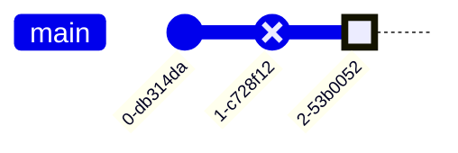
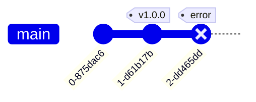
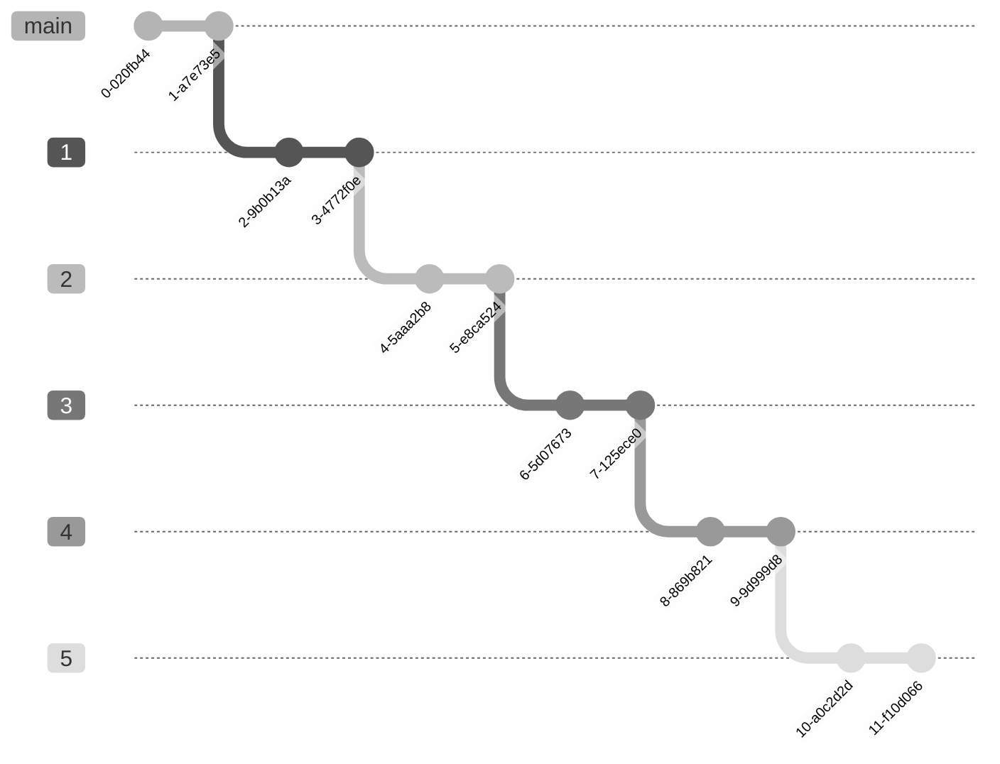
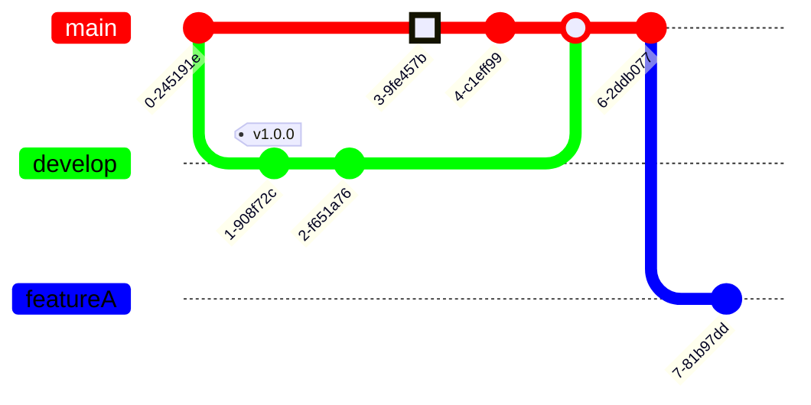
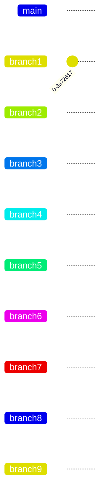
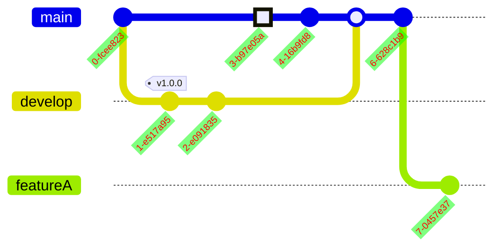
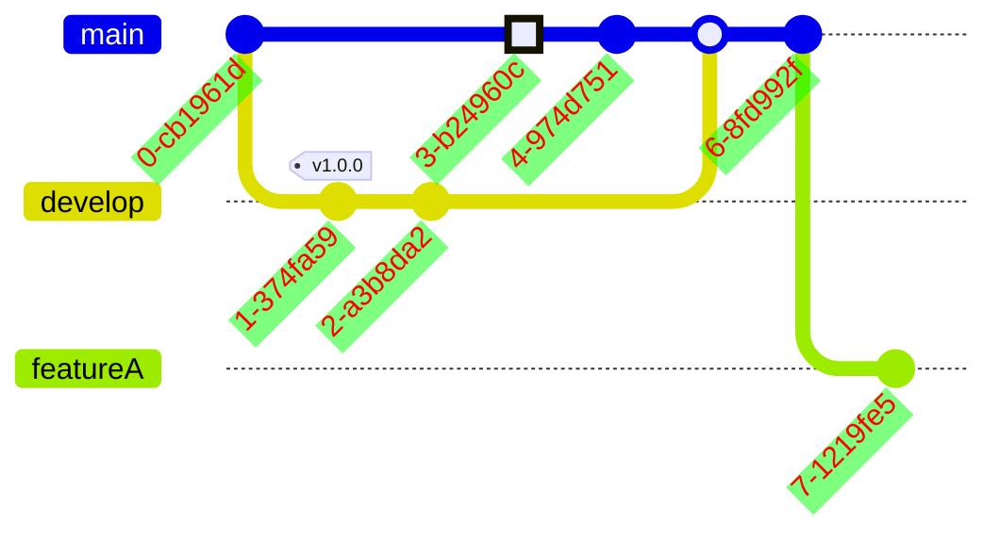
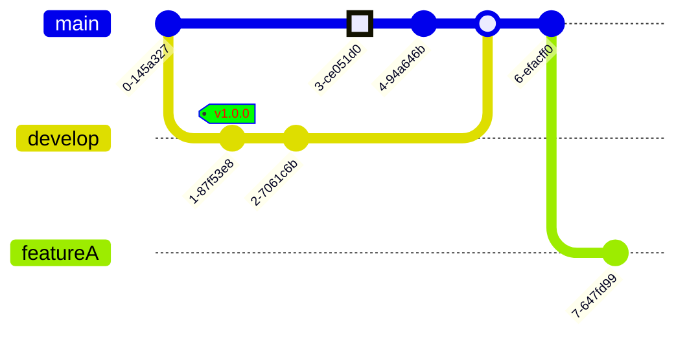

[TOC]
# Git图
Git 图表是各个分支上 git 提交和 git 操作（命令）的图形表示。
# 基本使用

# 语法
gitgraph 的 Mermaid 语法非常直接和简单。它遵循声明性方法，其中每个提交都按照其在代码中出现/存在的顺序绘制在图中的时间轴上。基本上，它遵循每个命令的插入顺序。
每个 gitgraph 都是用主分支初始化的。因此，除非你创建不同的分支，否则默认情况下提交将转到主分支。这是由 git 的工作方式驱动的，一开始你总是从主分支（以前称为 master 分支）开始。默认情况下，main 分支被设置为当前分支。
## 修改id
对于每个提交有个默认的id,如果需要修改这个id可以改成`commit id:"id"`

## 修改提交类型
NORMAL ：默认提交类型。图中用实心圆表示
REVERSE ：强调提交是反向提交。在图中用交叉实心圆表示。
HIGHLIGHT：高亮图中的特定提交。在图中用实心矩形表示。

## 标签添加

# 分支
通过提供`checkout`方法进行分支的切换，通过`branch`方法进行分支创建.通过`merge`方法合并分支. 

## 精心挑选
可以使用 `cherry-pick` 关键字从另一个分支中挑选提交。
要使用 `cherry-pick` 关键字，你必须使用 id 属性指定 id，后跟 : 以及 "" 引号内所需的提交 id。
在这里，在当前分支上创建了代表 cherry-pick 的新提交，并在图中以樱桃和描述从中挑选它的提交 ID 的标签在视觉上高亮。

这里需要注意的一些重要规则是：
* 如果给定的提交 ID 不存在，则会导致错误。
* 给定的提交不得存在于当前分支上。精心挑选的提交必须始终是与当前分支不同的分支。
* 当前分支必须至少有一次提交，然后才能进行 cherry-pick，否则会导致抛出错误。
* 当挑选合并提交时，必须提供父提交 ID。如果省略父属性或提供无效的父提交 ID，将引发错误。
* 指定的父提交必须是正在挑选的合并提交的直接父提交。

# 配置

* showBranches ：布尔值，默认为 true。如果设置为 false，则图中不会显示分支。
* showCommitLabel ：布尔值，默认为 true。如果设置为 false，则提交标签不会显示在图中。
* mainBranchName ：字符串，默认为 main。默认/根分支的名称。
* mainBranchOrder：主分支在分支列表中的位置。默认为 0，这意味着默认情况下 main 分支是顺序中的第一个分支。
* parallelCommits：布尔值，默认为 false。如果设置为 true，则距父级 x 距离的提交将显示在图中的同一级别。
* rotateCommitLabel：默认为true,设置为否时取消标签的旋转。
## 分支排序
Mermaid 遵循 order 关键字的给定优先顺序。
* 主分支始终首先显示，因为它的默认顺序值为 0。（除非使用配置中的 mainBranchOrder 关键字修改其顺序并从 0 更改）
* 接下来，所有没有 order 的分支按照它们在图表代码中出现的顺序显示。
* 接下来，所有具有 order 的分支都按照其 order 值的顺序显示。
* 要完全控制所有分支的顺序，必须为所有分支定义 order。
## 方向
* gitGraph LR:从左到右
* gitGraph TB:从上到下
* gitGraph BT:从下到上

# 主题
一共有五个主题,都是通过`'theme:xxx'`进行设置
* 基础:theme:'base'
* 森林:theme:'forest'
* 默认:theme:'default'
* 黑暗:theme:'dark'
* 中性:theme:'neutral'

# 自定义
Mermaid 允许你使用主题变量自定义图表，这些变量控制图表各个元素的外观和感觉。
## 分支颜色
可以使用 git0 到 git7 主题变量自定义分支颜色。Mermaid 允许你设置最多 8 个分支的颜色，其中 git0 变量将驱动第一个分支的值，git1 将驱动第二个分支的值，依此类推。

注意：这些主题变量的默认值是从选定的主题中选取的。如果你想覆盖默认值，可以使用 initialize 调用来添加自定义主题变量值。

## 分支标签颜色
可以使用 gitBranchLabel0 到 gitBranchLabel7 主题变量自定义分支标签颜色。Mermaid 允许你设置最多 8 个分支的颜色，其中 gitBranchLabel0 变量将驱动第一个分支标签的值，gitBranchLabel1 将驱动第二个分支标签的值，依此类推。

## 提交颜色
可以使用 commitLabelColor 和 commitLabelBackground 主题变量来自定义提交，分别更改提交标签颜色和背景颜色。

## 提交的标签字体大小
可以使用 commitLabelFontSize 主题变量来自定义提交，以更改提交标签的字体大小。

## 标签的字体大小
可以使用 tagLabelFontSize 主题变量来自定义提交，以更改标签 label 的字体大小。

## 标签颜色
可以使用 tagLabelColor、tagLabelBackground 和 tagLabelBorder 主题变量来自定义标签，分别更改标签标签颜色、标签标签背景颜色和标签标签边框。示例：现在让我们覆盖 tagLabelColor、tagLabelBackground 和 tagLabelBorder 变量的默认值：

## 高亮提交颜色
可以使用 gitInv0 到 gitInv7 主题变量自定义与其所在分支相关的高亮提交颜色。Mermaid 允许你为最多 8 个分支特定高亮提交设置颜色，其中 gitInv0 变量将驱动第一个分支的高亮提交的值，gitInv1 将驱动第二个分支的高亮提交标签的值，依此类推。

