[TOC]
# UML
序列图是一种交互图，显示进程如何彼此运行以及以什么顺序运行。该序列图不同于基础的序列图.
# 基本使用
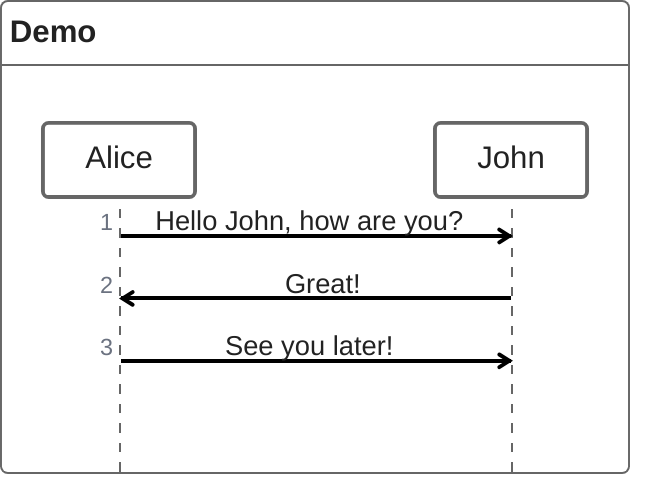
# 语法
## 参加者
参与者或参与者按照图表源文本中的出现顺序渲染。有时，你可能希望以不同于第一条消息中的顺序显示参与者。可以通过执行以下操作来指定角色的出场顺序：
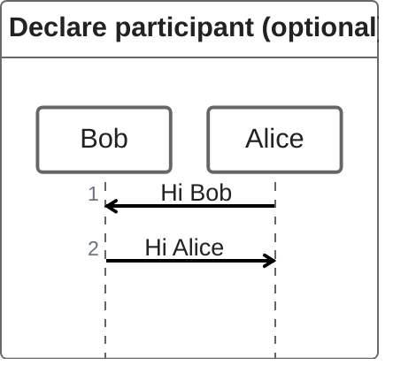
## 注释者
特别想使用符号而不仅仅是带有文本的矩形，你可以通过使用注释器语法来声明参与者，如下所示.
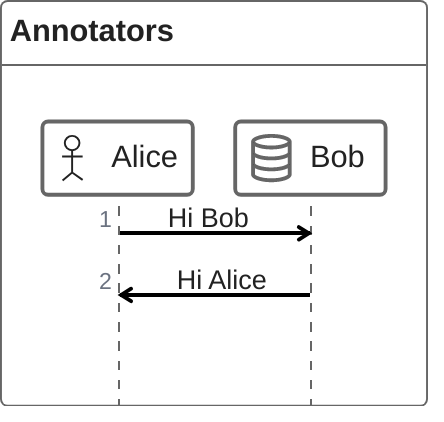

相关的注释器还有如下
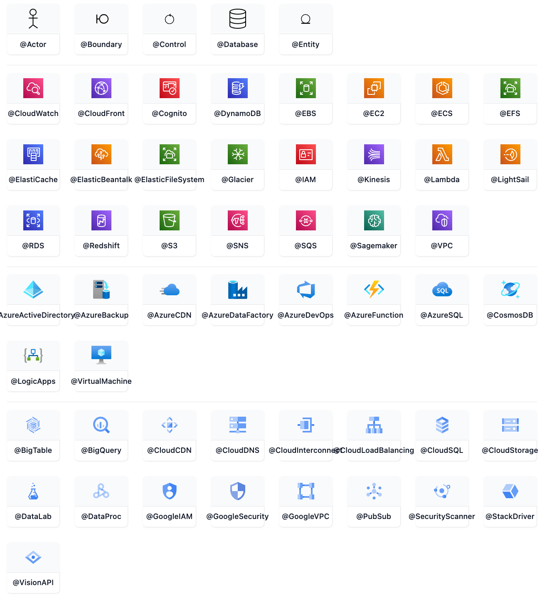

## 别名
参与者可以有一个方便的标识符和描述性标签。
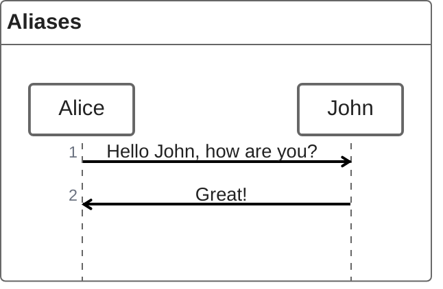
## 信息
消息可以是以下之一：
同步消息
异步消息
创建消息
响应消息
### 同步信息
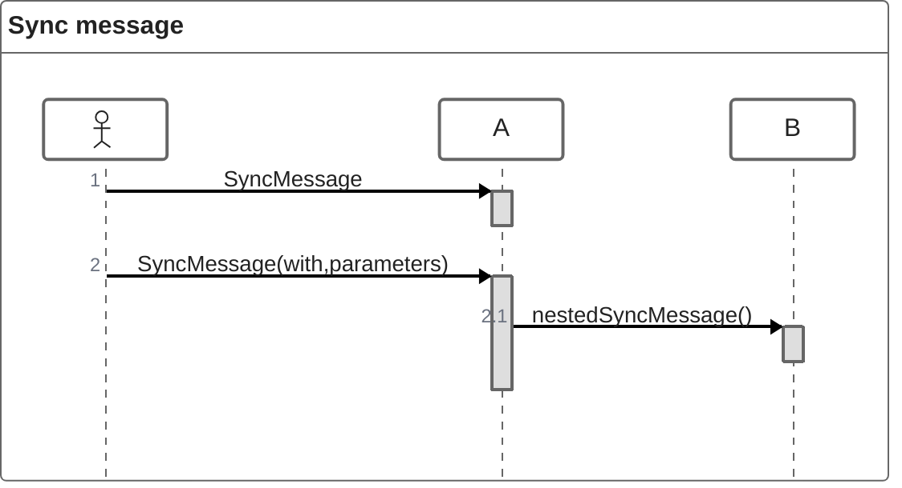
### 异步信息
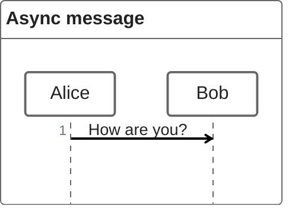
### 创建信息
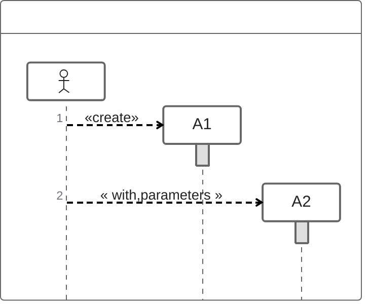
### 响应信息
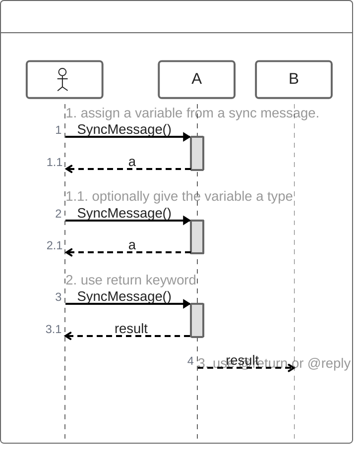
### 信息嵌套
同步消息和创建消息自然可以与 {} 嵌套。
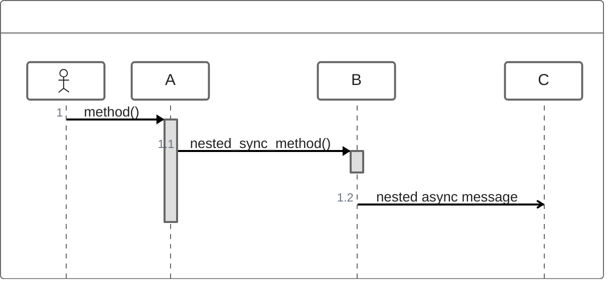
## 循环
通过以下几种方式实现：
1.while
2.for
3.forEach
4.loop
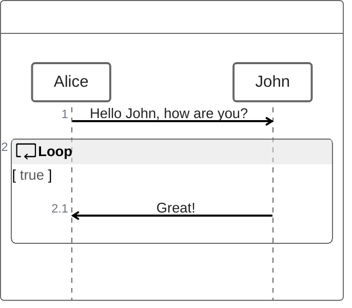
## 判断
通过if...else实现
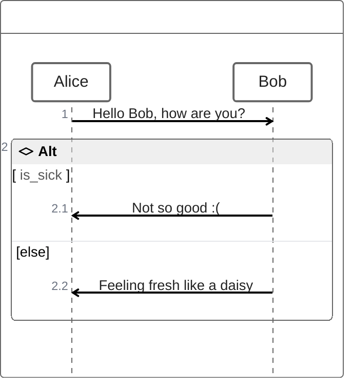
## 选择
通过opt实现
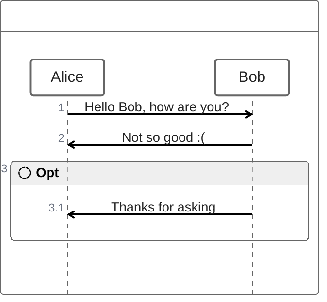
## 异常捕获
通过try/catch/finally来实现.
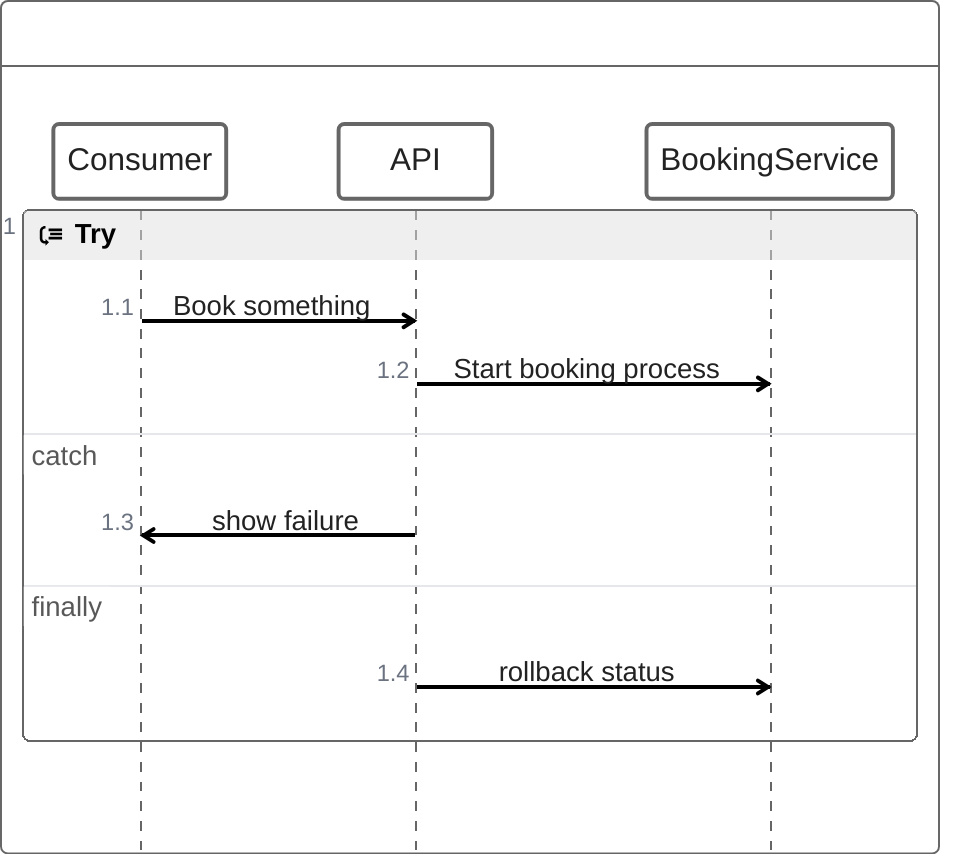

