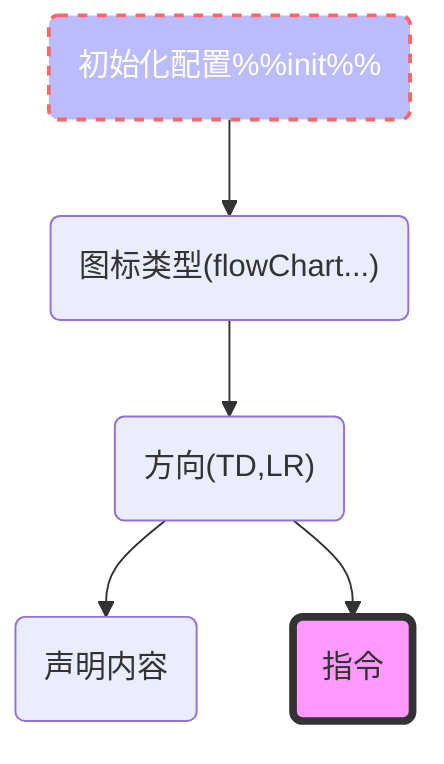

[TOC]
# mermaid
Mermaid 允许你使用文本和代码创建图表和可视化。
它是一个基于 JavaScript 的图表绘制工具，可渲染 Markdown 启发的文本定义以动态创建和修改图表。
参考网站:https://mermaid.nodejs.cn/intro/
# mermaid 实时网站
[在线编译网站](https://mermaid.live/)
## 图表代码
在 Code 面板中，编写或编辑 Mermaid 代码，并立即在图表面板中 Preview 渲染结果。
## 配置
Configuration 面板中提供了配置选项。这些选项将应用于 Preview 面板中的图表。
要了解更多信息，请访问 [配置参考](https://mermaid.nodejs.cn/config/setup/README.html)页面
## 编辑历史记录
你的代码将自动保存并显示在 History 部分的 Timeline 选项卡中。每分钟都会保存编辑内容，并且只能查看最后 30 条编辑内容。
或者，你可以通过单击 History 部分中的 Save 图标来手动保存代码。
## 保存图表
有多种方法可以保存 Actions 部分的图表：
导出 PNG
导出 SVG
导出为 Markdown
## 从Gists加载
你创建的 Gist 应该有一个 code.mmd 文件和一个可选的 config.json，类似于此 example。
[Gists 网站](https://docs.github.com/en/get-started/writing-on-github/editing-and-sharing-content-with-gists/creating-gists)

创建 Gist 后，将 Gist URL 复制粘贴到 Actions 部分的相应字段中，然后单击 Load Gist 按钮。
# mermaid 安装
1.通过vscode插件提供支持.
2.如果是node的情况下,需要node v16,然后通过npm i mermaid进行安装
3.如果是使用scriptCDN,需要采用如下的安装方式.
```
<script type="module">
  import mermaid from 'https://cdn.jsdelivr.net/npm/mermaid@11/dist/mermaid.esm.min.mjs';
  mermaid.initialize({ startOnLoad: true });
</script>
```
# mermaid 语法




# mermaid 全局配置&指令
详情查看[配置.md](./配置.md)与[指令.md](./指令.md)