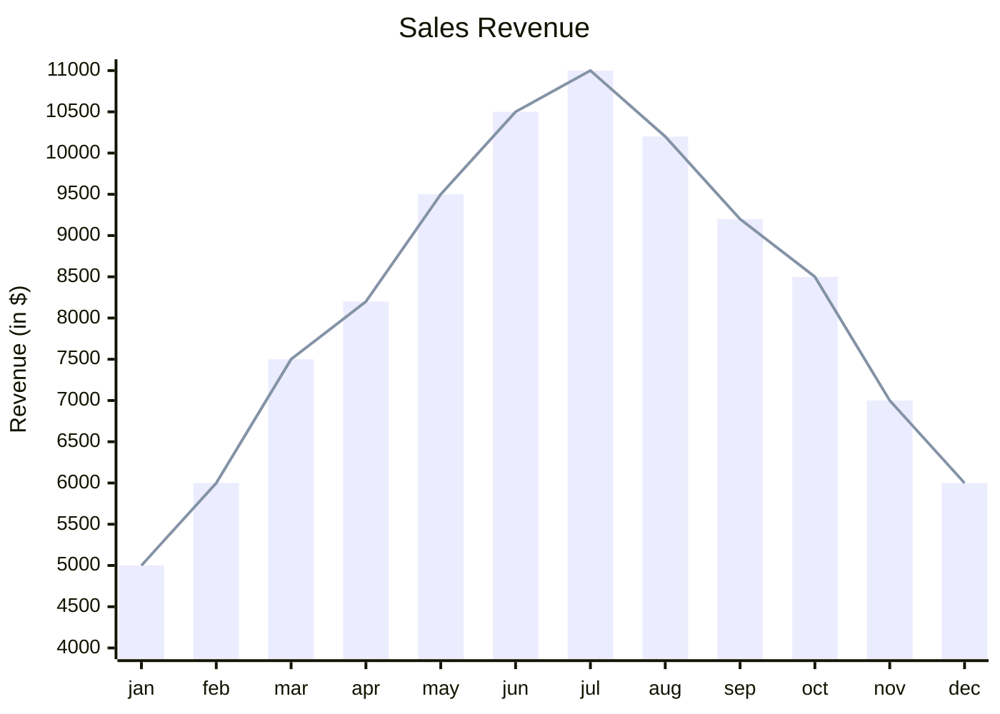
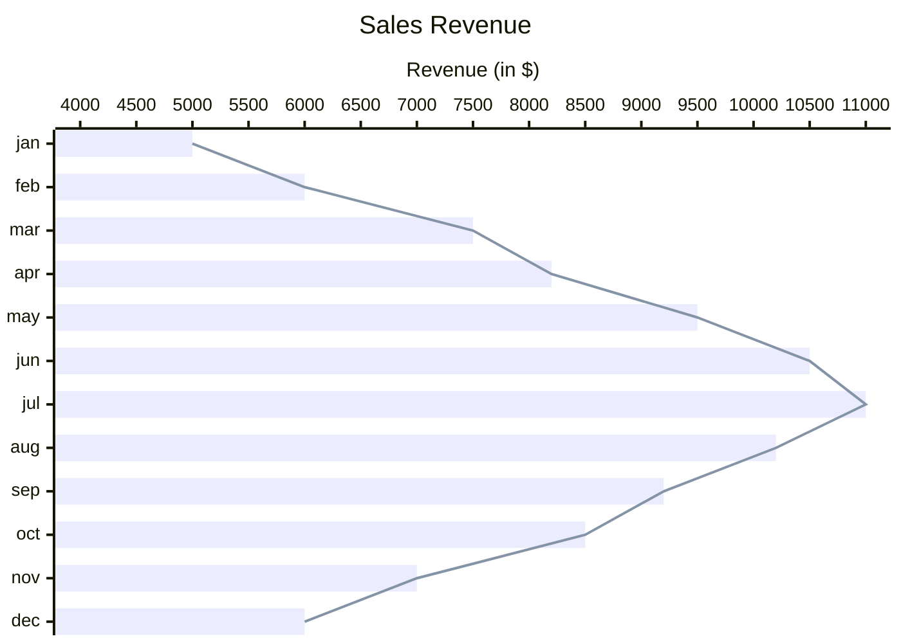
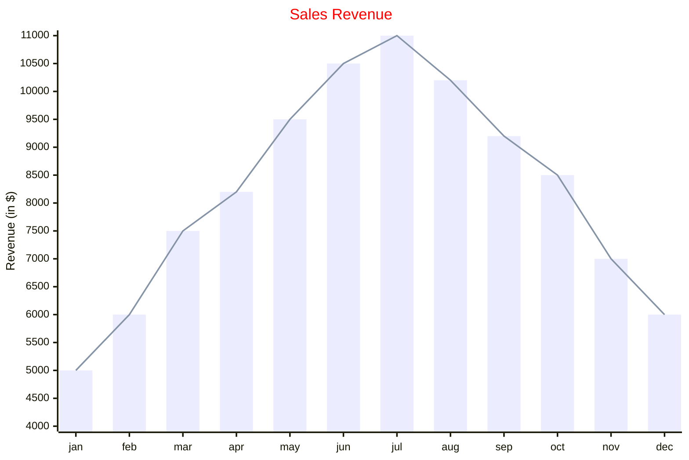

[TOC]
# 坐标图
目前，它包括两种基本图表类型：柱状图和折线图。这些图表旨在直观地显示和分析涉及两个数值变量的数据。
# 基本使用

# 方向
可以通过设置`vertical`或者`horizontal`来调整方向.

# x-axis/y-axis
* x-axis title min --> max x 轴将用作给定范围内的数字
* x-axis "title with space" [cat1, "cat2 with space", cat3] x 轴（如果是分类），类别是文本类型
* y-axis title min --> max
* y-axis title 它只会添加标题，范围将根据数据自动生成。
# 折线图/柱状图
* line [2.3, 45, .98, -3.4] 
* bar [2.3, 45, .98, -3.4] 
# 图表配置
参数|	描述|	默认值
---|---|---
width|	图表的宽度|	700
height|	图表的高度|	500
titlePadding|	标题的顶部和底部填充|	10
titleFontSize|	标题字体大小|	20
showTitle|	标题是否显示|	true
xAxis|	x 轴配置|	AxisConfig
yAxis|	y 轴配置|	AxisConfig
chartOrientation|	'vertical' 或 'horizontal'|	'vertical'
plotReservedSpacePercent|	最小空间图将占据图表内部	|50
# 坐标轴参数
参数|	描述|	默认值
---|---|---
showLabel|	显示轴标签或刻度值|	true
labelFontSize|	要绘制的标签的字体大小|	14
labelPadding|	标签的顶部和底部填充|	5
showTitle|	是否显示轴标题|	true
titleFontSize|	轴标题字体大小|	16
titlePadding|	轴标题的顶部和底部填充	|5
showTick|	勾选是否显示|	true
tickLength|	刻度线会持续多长时间|	5
tickWidth|	刻度线的宽度是多少|	2
showAxisLine|	轴线是否显示|	true
axisLineWidth|	轴线粗细|	2
# 主题变量
参数|描述
---|---
backgroundColor|整个图表的背景颜色
titleColor|标题文本的颜色
xAxisLabelColor|x轴标签的颜色
xAxisTitleColor|x轴标题的颜色
xAxisTickColor|x轴刻度线的颜色
xAxisLineColor|x轴线的颜色
yAxisLabelColor|y轴标签的颜色
yAxisTitleColor|y轴标题的颜色
yAxisTickColor|y轴刻度的颜色
yAxisLineColor|y轴线的颜色
plotColorPalette|用逗号分隔的颜色字符串，例如"#f3456, #43445"
# 配置
