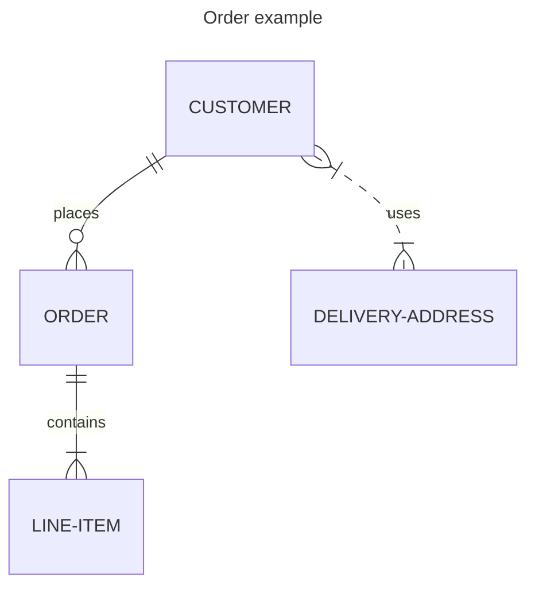
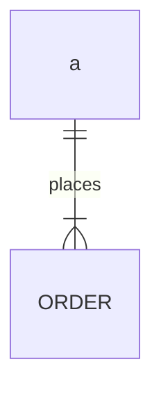
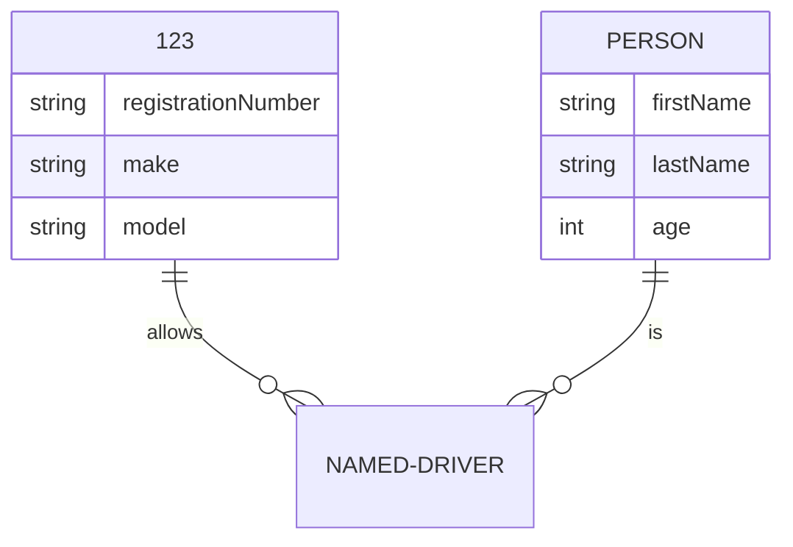
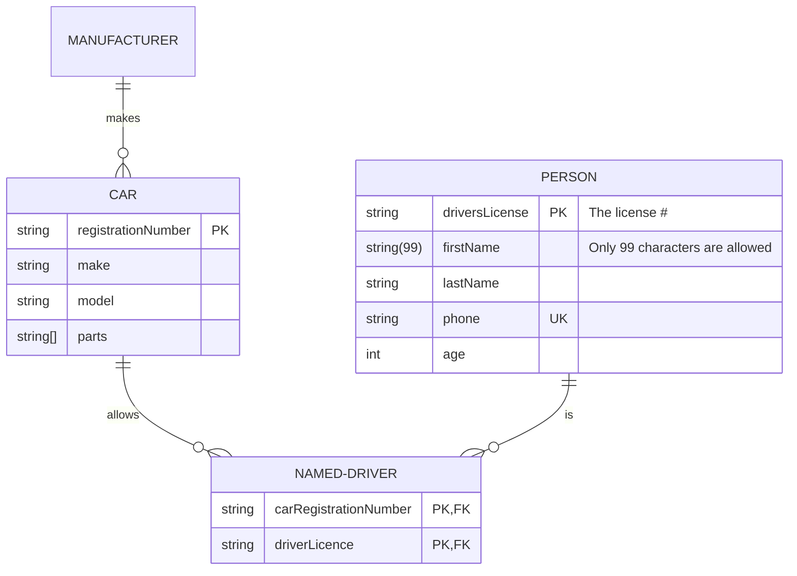

[TOC]
# 实体图
实体关系模型（或 ER 模型）描述特定知识字段中相关的感兴趣的事物。基本 ER 模型由实体类型（对感兴趣的事物进行分类）组成，并指定实体（这些实体类型的实例）之间可以存在的关系.

# 基本使用

# 语法
    <first-entity> <relationship> <second-entity> : <relationship-label>
* first-entity 是实体的名称。名称必须以字母字符或下划线开头（从 v10.5.0+ 开始），并且还可以包含数字和连字符。
* relationship 描述了两个实体相互关联的方式。见下文。
* second-entity 是另一个实体的名称。
* relationship-label 从第一实体的角度描述关系。
如下所述
first-entity:a
relationship:||(一个) --(实线) |{(一个或多个)
second-entity:ORDER
relationship-label:places

# 关系语法
如上所述，接下来说明以下基数关系
左值|右值|意义
--|--|--
\|o|o\||0或者1
\|\||\|\||正好1个
}o|o{|0个或多个
}\||\|{|1个或多个

于此还有实线用`--`来表示,虚线用`..`来表示
# 属性
在表示完对象的关系后，如果某些类中具有一定的属性，可以通过对象的形式记录
如果需要修改类中的别名可以在其后面加上["别名"]来表示.

# 键值对
属性还可以定义 key 或注释。键可以是 PK、FK 或 UK，分别表示主键、外键或唯一键。要在单个属性上指定多个键约束，请用逗号分隔它们（例如，PK, FK）。

# 样式
选择器	|描述
--|--
.er.attributeBoxEven|	包含偶数行属性的框
.er.attributeBoxOdd|	包含奇数行属性的框
.er.entityBox|	代表实体的方框
.er.entityLabel|	实体的标签
.er.relationshipLabel|	关系的标签
.er.relationshipLabelBox|	关系标签周围的框
.er.relationshipLine|	表示实体之间关系的线