[TOC]
# 序列图
序列图是一种交互图，显示进程如何彼此运行以及以什么顺序运行。
## 基本使用
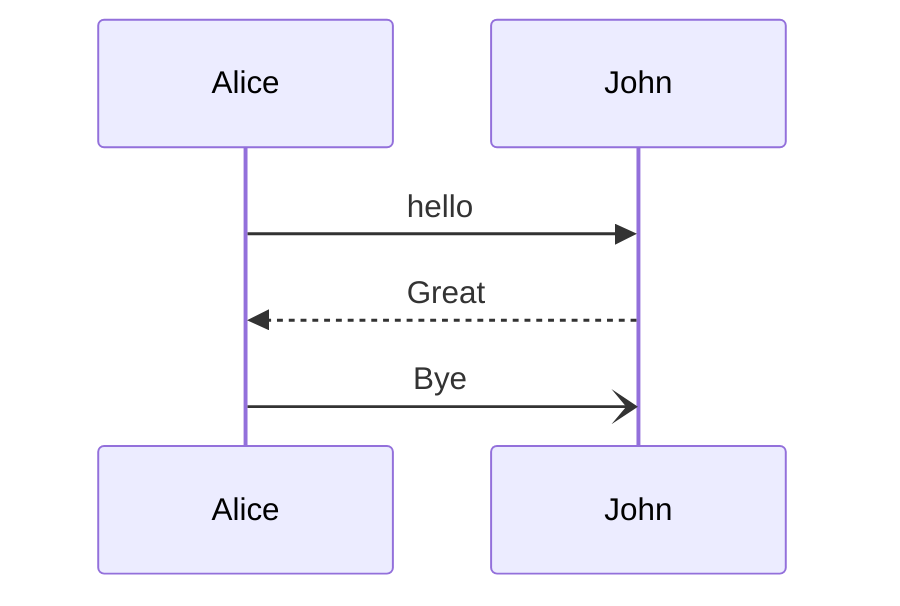
## 基本语法
### 参与者
参与者或参与者按照图表源文本中的出现顺序渲染。有时，你可能希望以不同于第一条消息中的顺序显示参与者,那么通过修改participant的顺序即可.
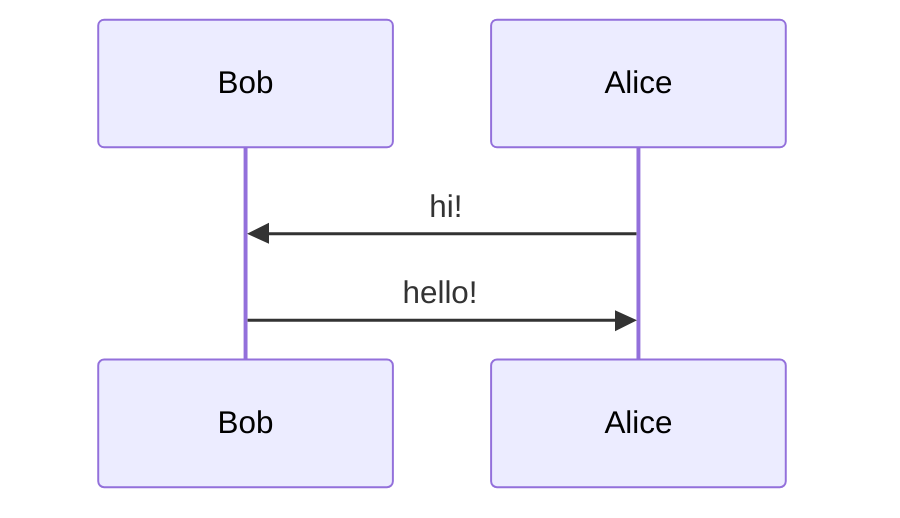
### 角色
如果不希望使用矩形的样式而是通过其他的可以改用actor
角色还有个属性就是别名，也就是修改其名字，引用的时候还是用回原来的.
可以在代码中临时加入create与摧毁destroy
还有激活角色activate与停用角色deactivate
快捷表示activate与deactivate可以通过箭头后附加+/-后缀来表示.
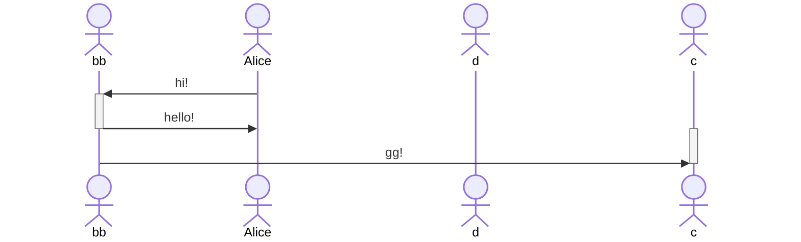
## 信息类型
格式为:[传递人][箭头][接收人]:[信息]
箭头有以下十种类型.
类型|描述
---|---
->|没有箭头的实线
-->|没有箭头的虚线
-->>|	带箭头的虚线
<<->>|	带双向箭头的实线
<<-->>|	带双向箭头的虚线 
-x	|末端有十字的实线
--x	|末端带有十字的虚线。
-)	|末尾带有空心箭头的实线（异步）
--)	|末尾带有空心箭头的虚线（异步）

## 分组
通过设置 box [颜色] [标题名]来进行分组处理,需要在分组完的结尾使用end结束标签
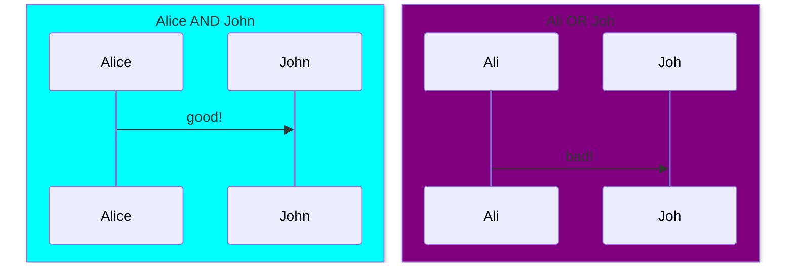

## 注释
使用Note [位置] of [参与者]
或者Note over [某个参与者],[某个参与者]；来实现多位置的覆盖Note
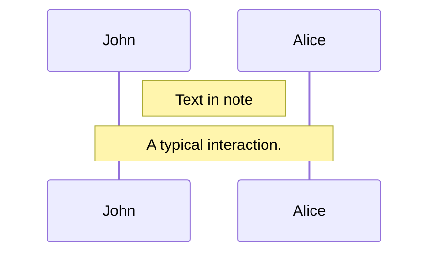

## 换行符
在消息里面加入`<br>`即可.

## 循环
通过设置Loop [时间] [文本]来实现
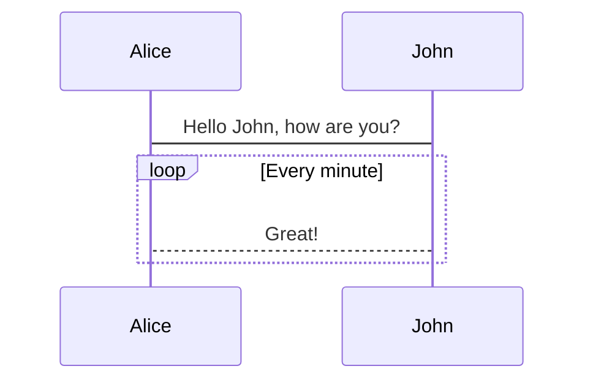
## 判断
可以设置alt与opt两种选项设置
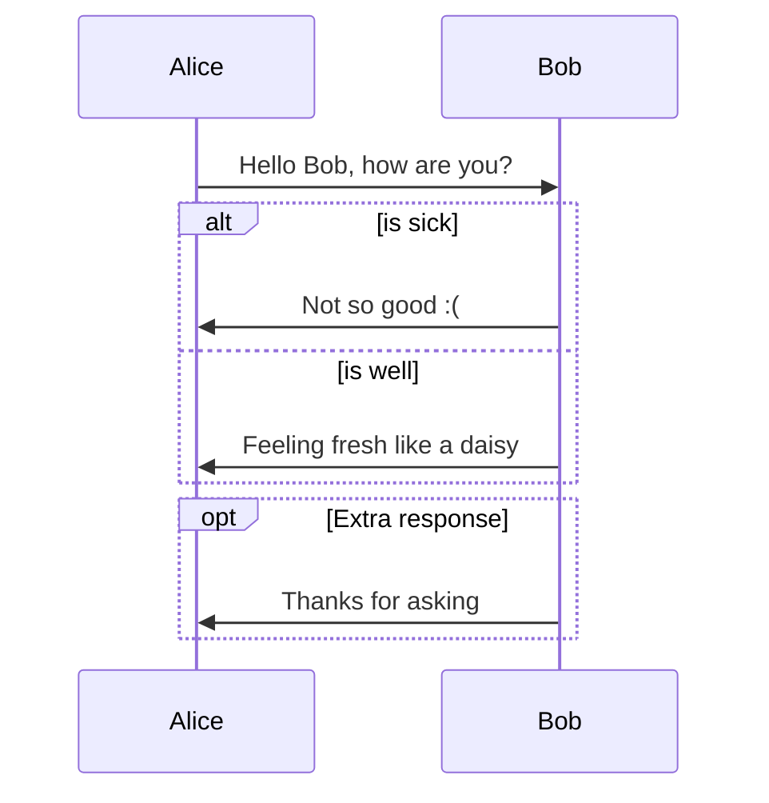
## 平行线
通过par and and 的格式来实现
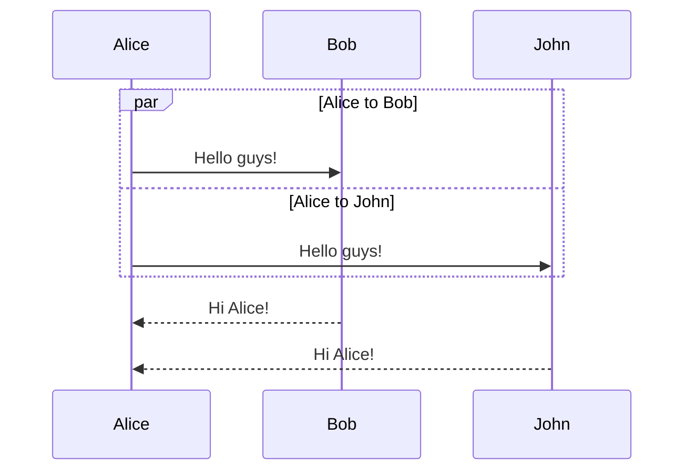
## 临界区
通过critical Establish a connection option option 也可以不设置option来实现.
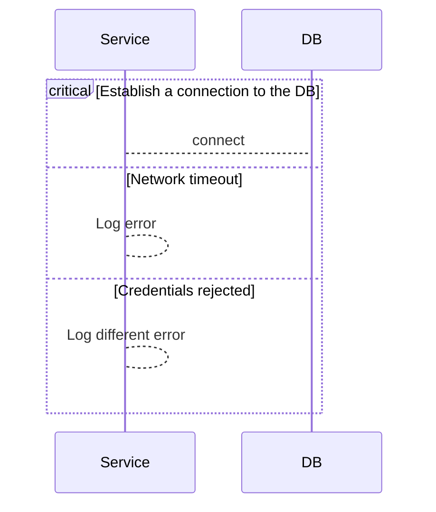
## 中断
通过break 来实现
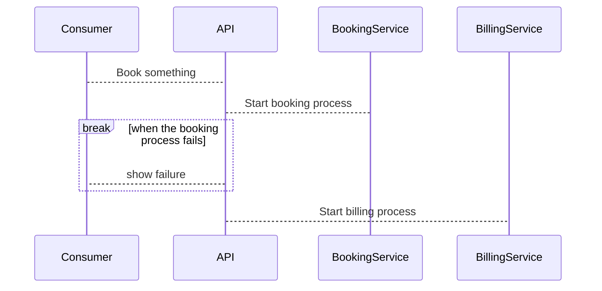
## 背景高亮
通过提供rect [颜色]来实现
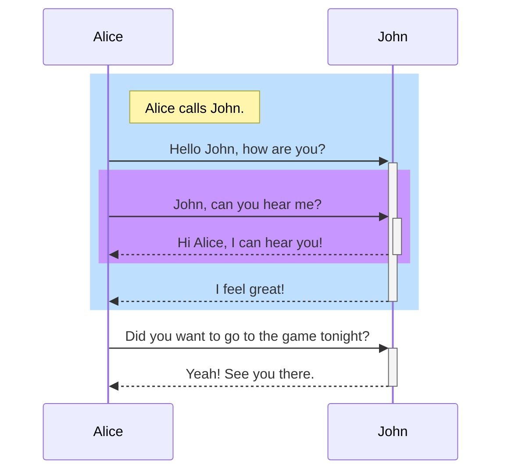
## 注释
使用%%来实现注释，注释开始后到下一个换行符的任何文本都会被注释掉

## 转义字符
与流程图中的转义字符同理#quot;之类的
## 角色菜单
参与者可以拥有包含指向外部页面的个性化链接的弹出菜单。例如，如果参与者代表 Web 服务，则有用的链接可能包括指向服务运行状况仪表板的链接、包含服务代码的存储库或描述服务的 wiki 页面。可以通过添加连接线来配置
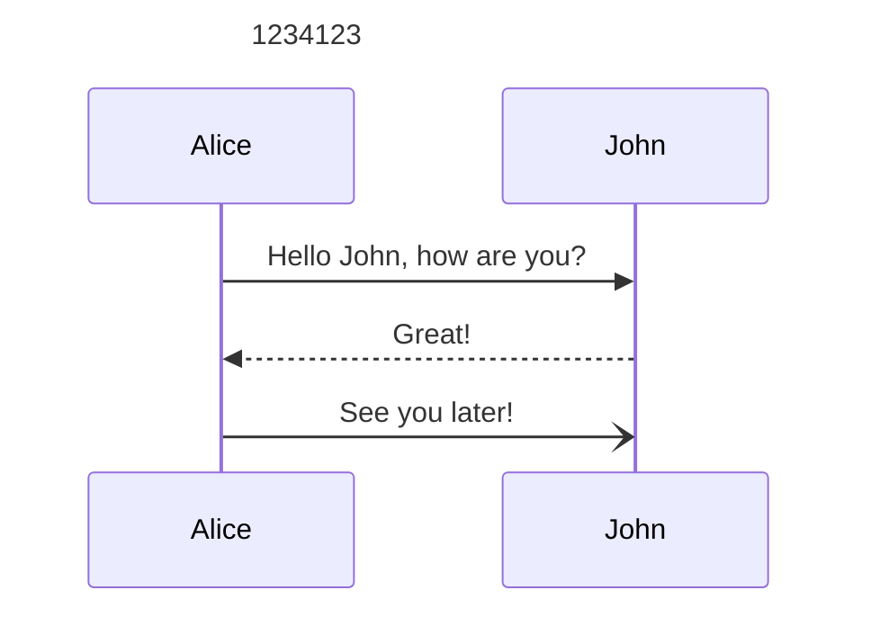
## 样式
序列图的样式是通过定义许多 CSS 类来完成的。在渲染期间，从位于 src/themes/sequence.scss 的文件中提取这些类
类|	描述
---|---
actor|角色框的样式。
actor-top|图表顶部的角色人物/框的样式。
actor-bottom|图表底部的角色人物/框的样式。
text.actor|所有角色的文本样式。
text.actor-box|角色框的文本样式。
text.actor-man|角色人物的文本样式。
角色线	角色的垂直线。
messageLine0|实心消息行的样式。
messageLine1|虚线消息行的样式。
messageText|定义消息箭头上的文本样式。
labelBox|定义循环左侧的样式标签。
labelText|循环标签中文本的样式。
loopText|循环框中文本的样式。
loopLine|定义循环框中线条的样式。
note|注释框的样式。
noteText|注释框中文本的样式。
## 配置
与流程图同样，需要使用mermaid.sequenceConfig进行配置.
```
mermaid.sequenceConfig = {
  diagramMarginX: 50,
  diagramMarginY: 10,
  boxTextMargin: 5,
  noteMargin: 10,
  messageMargin: 35,
  mirrorActors: true,
};
```
参数|描述	|默认值
---|---|---
mirrorActors|	打开/关闭图表下方和上方参与者的渲染	|false
bottomMarginAdj	|调整图表结束的距离。使用 css 的宽边框样式可能会产生不需要的剪裁，这就是此配置参数存在的原因。|	1
actorFontSize|	设置角色描述的字体大小	|14
actorFontFamily|	设置角色描述的字体系列|	"Open Sans", sans-serif
actorFontWeight|		设置角色描述的字体粗细|	"Open Sans", sans-serif
noteFontSize|	设置角色附加注释的字体大小	|14
noteFontFamily|	设置角色附加注释的字体系列|	"trebuchet ms", verdana, arial
noteFontWeight|	设置角色附加注释的字体粗细|	"trebuchet ms", verdana, arial
noteAlign|	设置角色附加注释中文本的文本对齐方式|	center
messageFontSize|	设置角色<->角色消息的字体大小|	16
messageFontFamily|设置 actor<->actor 消息的字体系列|	"trebuchet ms", verdana, arial
messageFontWeight|设置角色<->角色消息的字体粗细	|	"trebuchet ms", verdana, arial