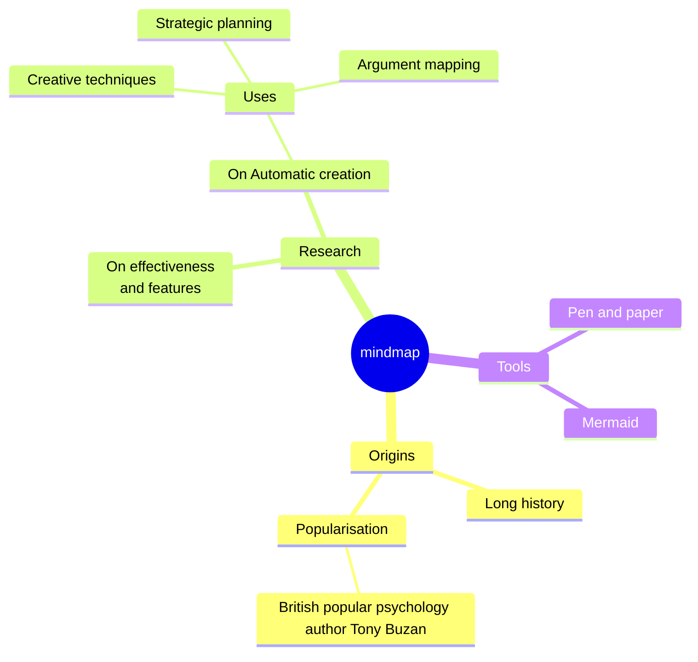
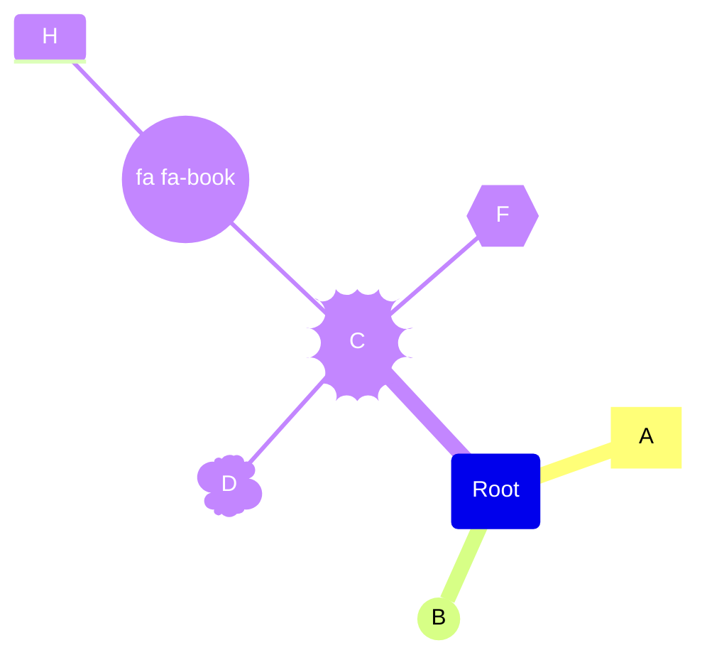

# 思维导图
思维导图是一种图表，用于将信息直观地组织成层次结构，显示整体各个部分之间的关系。它通常是围绕一个概念创建的，在空白页面的中心绘制为图片，并在其中添加相关的想法表示，例如图片、单词和单词的一部分。主要思想与中心概念直接相关，而其他思想则从这些主要思想中分支出来.
# 基本使用

# 语法
创建思维导图的语法很简单，并且依赖于缩进来设置层次结构中的级别。

# 不同形状
*  []长方形
*  (())圆形
*  ))(( boom
* )( 云彩
* icon() 引入对应图标
* {{}} 六边形

# 字符串(查看流程图)
