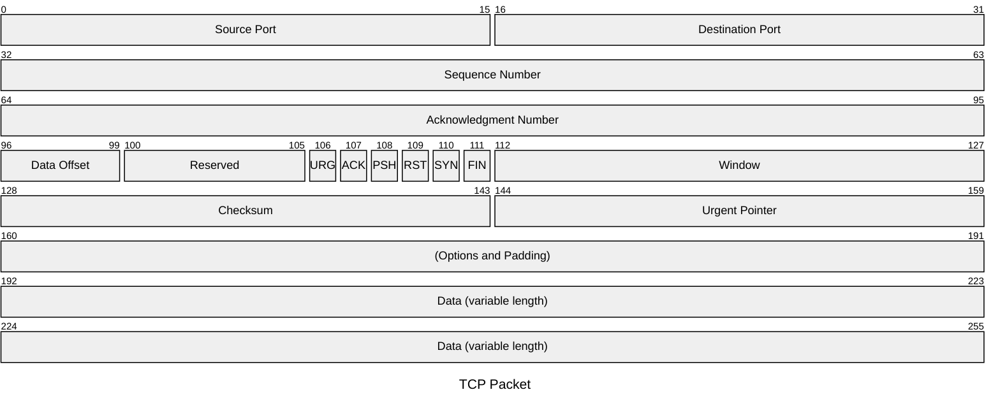

# 数据包图
## 介绍 
数据包图是用于说明网络数据包的结构和内容的可视化表示。网络数据包是通过网络传输的数据的基本单位。
## 用法
这种图表类型对于需要清晰简洁的方式来表示网络数据包结构的网络工程师、教育工作者和学生特别有用。
# 语法

```mermaid
---
title: "TCP Packet"
---
packet-beta
0-15: "Source Port"
16-31: "Destination Port"
32-63: "Sequence Number"
64-95: "Acknowledgment Number"
96-99: "Data Offset"
100-105: "Reserved"
106: "URG"
107: "ACK"
108: "PSH"
109: "RST"
110: "SYN"
111: "FIN"
112-127: "Window"
128-143: "Checksum"
144-159: "Urgent Pointer"
160-191: "(Options and Padding)"
192-255: "Data (variable length)"

```