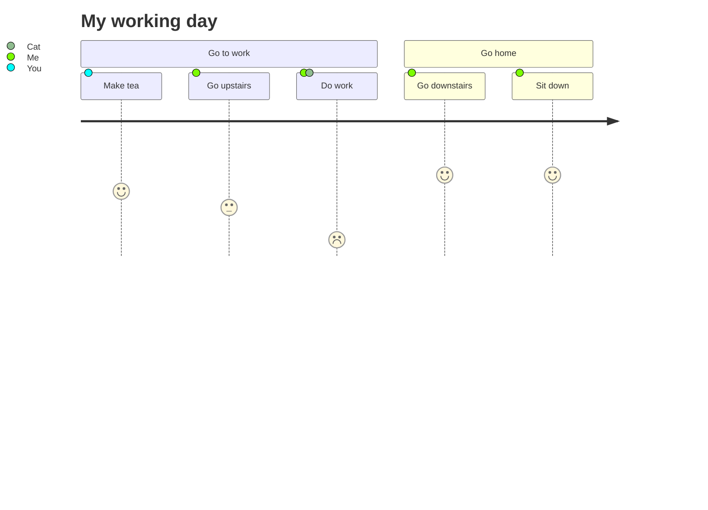

# 旅程图
旅程图高度详细地描述了不同用户在系统、应用或网站内完成特定任务所采取的步骤。该技术显示当前（原样）用户工作流程，并揭示未来工作流程的改进字段
# 基本使用

```mermaid
journey
    title My working day
    section Go to work
      Make tea: 4:You
      Go upstairs: 3: Me
      Do work: 1: Me, Cat
    section Go home
      Go downstairs: 5: Me
      Sit down: 5: Me

```
```
首先是标题名
title <标题名>
其次是分开章节每个时间段的任务
section <任务>
然后是每个章节下的任务与心情以及对象
<事情>:<心情>:<对象>
```