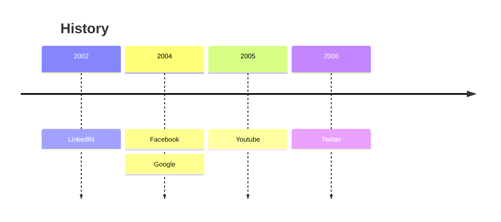
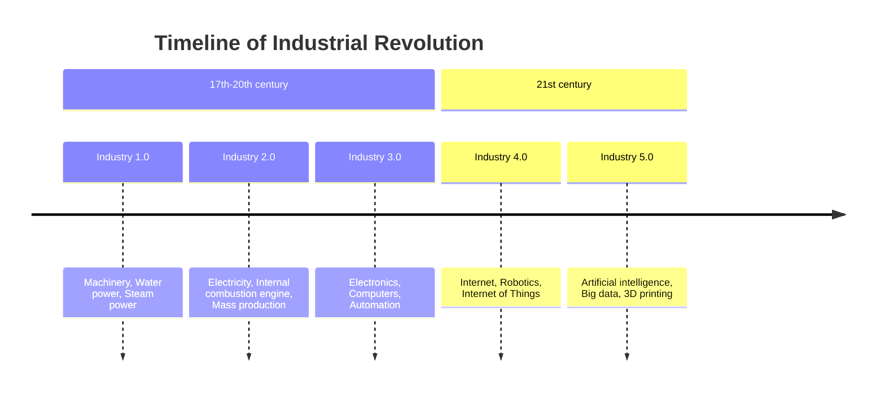
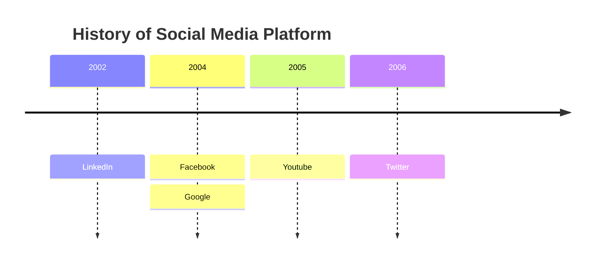
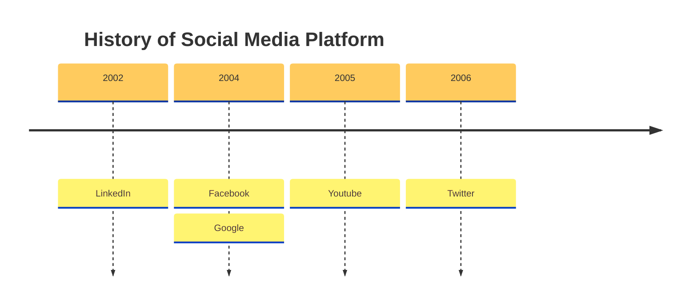
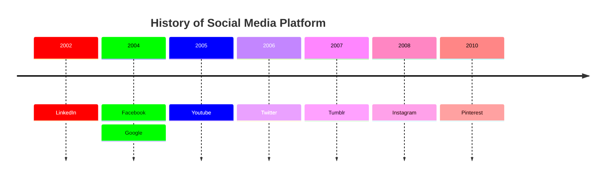

[TOC]
# 时间线
时间线是一种图表，用于说明事件、日期或时间段的年表。它通常以图形方式渲染以指示时间的流逝，并且通常按时间顺序组织。基本时间线按时间顺序渲染事件列表，通常使用日期作为标记。时间线还可以用来展示事件之间的关系，比如一个人一生中的事件之间的关系
# 基本使用

# 语法
创建时间线图的语法很简单。你始终以 timeline 关键字开头，让 mermaid 知道需要创建时间线图。

之后，可以向时间线添加标题。这是通过添加一行带有关键字 title 后跟标题文本来完成的。

然后添加时间线数据，其中始终以时间段开头，后跟冒号，然后是事件的文本。你可以选择添加第二个冒号，然后添加事件的文本。
```
timeline
    title
    {time} : {event}
    {time} : {event} : {event}
```
# 分组
通过`section`的方式可以在一个图中形成多个分组.

# 换行
默认情况下，如果时间段和事件的文本太长，则会换行。这样做是为了避免文本绘制在图表之外。可以使用 <br> 强制换行。
# 时间段和事件的样式
如前所述，每个部分都有一个配色方案，并且该部分下的每个时间段和事件都遵循相似的配色方案。

但是，如果没有定义部分，那么我们有两种可能性：

1.单独设置时间段的样式，即每个时间段（及其相应的事件）都有自己的配色方案。这是默认行为。

2.使用 disableMultiColor 选项禁用多色选项。这将使所有时间段和事件遵循相同的配色方案。
需要通过 mermaid.initialize 函数或指令添加此选项。
```
mermaid.initialize({
        theme: 'base',
        startOnLoad: true,
        logLevel: 0,
        timeline: {
          disableMulticolor: false,
        },
        ...
        ...
```

# 自定义配色
可以使用 cScale0 到 cScale11 主题变量自定义配色方案，这将更改背景颜色。Mermaid 允许你为最多 12 个部分设置独特的颜色，其中 cScale0 变量将驱动第一个部分或时间段的值，cScale1 将驱动第二个部分的值，依此类推。如果你的部分超过 12 个，配色方案将开始重复。

如果你还想更改某个部分的前景色，可以使用与 cScaleLabel0 到 cScaleLabel11 变量相对应的主题变量。

注意：这些主题变量的默认值是从选定的主题中选取的。如果你想覆盖默认值，可以使用 initialize 调用来添加自定义主题变量值。

# 主题(参考思维导图)