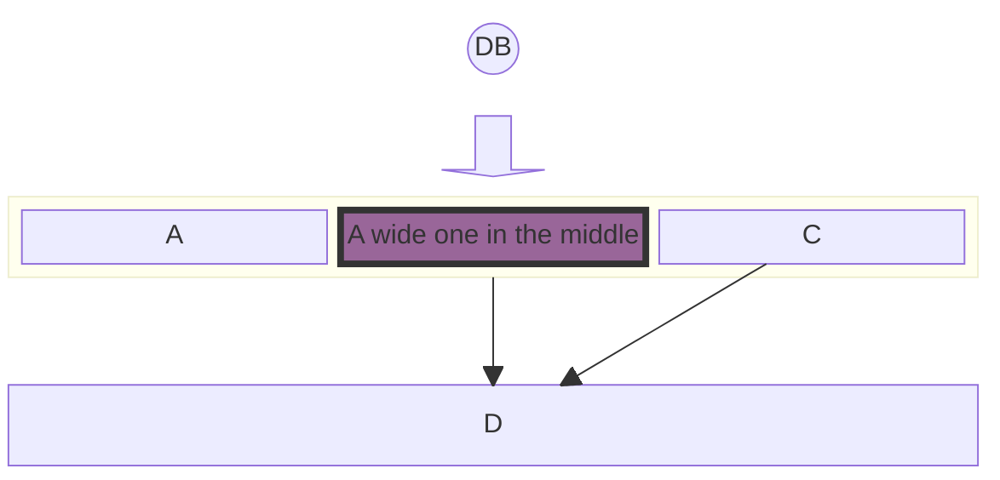
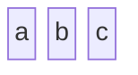
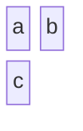
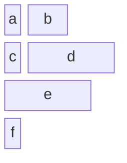
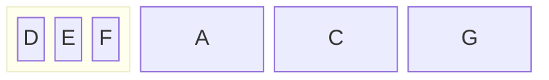
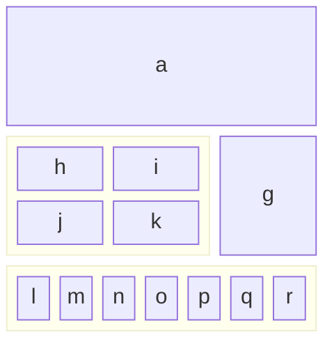
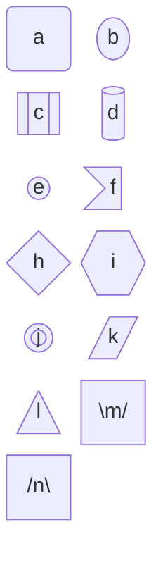
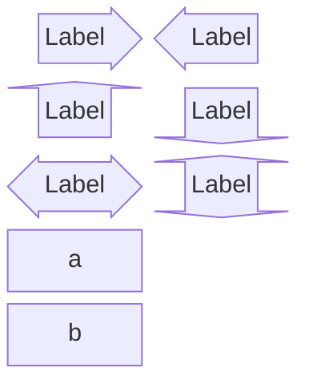
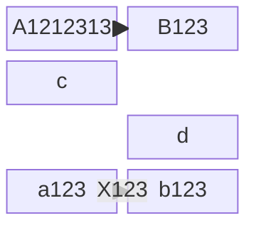

[TOC]
# 框图
框图是一种直观、有效的方式来直观地表示复杂的系统、流程或架构。它们由块和连接器组成，其中块代表基本组件或功能，连接器显示这些组件之间的关系或流程。这种图表方法在工程、软件开发和流程管理等各个字段都至关重要。

框图的主要目的是提供系统的高级视图，以便轻松理解和分析，而无需深入研究每个组件的复杂细节。这使得它们对于简化复杂系统以及解释系统内组件的整体结构和交互特别有用。
# 基本使用

# 建立块
框图的核心是由代表不同实体或组件的块组成。在 Mermaid 中，这些块可以使用简单的文本标签轻松创建。框图的最基本形式可以是一系列没有任何连接器的块。

# 定义列数
在更复杂的图表中，你可能需要跨越多个列的块来强调某些组件或表示更大的实体。Mermaid 允许调整块宽度以覆盖多个列，从而增强图表的可读性和结构。

# 设置块宽度
需要注意的是:当一个块的宽度大于1行时，其会占据在当前列中，而大于n行时则会将多出的行全部空出.

# 复合块
复合块或块中的块是 Mermaid 框图语法中的一项高级功能。它们允许表示嵌套或分层系统，其中一个组件包含多个子组件。

# 列宽动态
Mermaid 还允许根据块的内容动态调整列宽。列的宽度由列中最宽的块确定，确保图表保持平衡和可读。

# 块形状

# 块箭头和空格块

# 基本箭头和箭头类型

# 块样式
