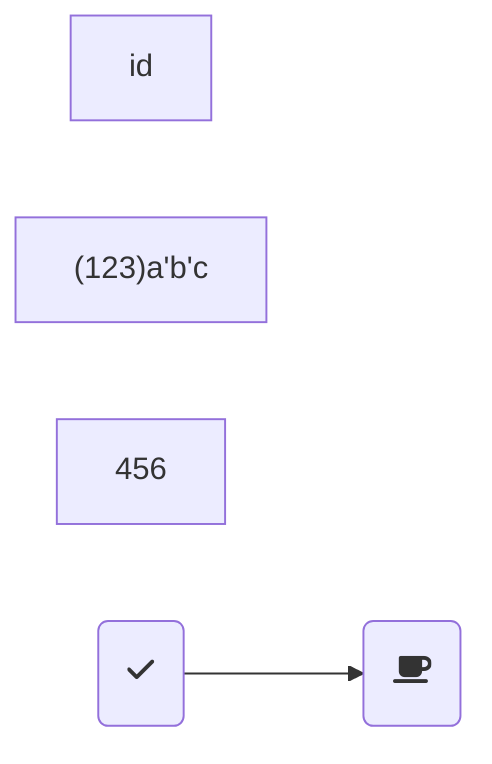

[TOC]
# 流程图
流程图由节点（几何形状）和边（箭头或线条）组成。Mermaid 代码定义了如何制作节点和边，并适应不同的箭头类型、多方向箭头以及任何与子图的链接。
## 节点
直接在图标类型下面空行命名就可以作为节点
如果需要设置其他文本那么命名方式为
id[name]
当然很多时候，需要使用id["name"]的形式以避免带有{}等等的框格冲突，例如需要(123)这样的形式时就会报错.

