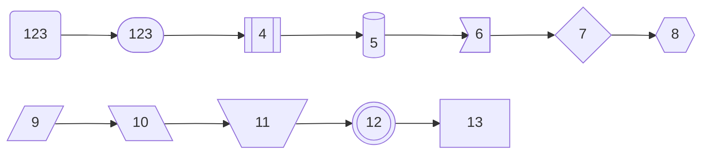

[TOC]
# 流程图
流程图由节点（几何形状）和边（箭头或线条）组成。Mermaid 代码定义了如何制作节点和边，并适应不同的箭头类型、多方向箭头以及任何与子图的链接。
## 节点
直接在图标类型下面空行命名就可以作为节点
如果需要设置其他文本那么命名方式为
id[name]
当然很多时候，需要使用id["name"]的形式以避免带有{}等等的框格冲突，例如需要(123)这样的形式时就会报错.

## 方向

* LR(左到右)
* RL(右到左)
* BT(下到上)
* TB(上到下)


## 节点形状
* () 方形
* ([]) 椭圆
* [[]] 嵌套方形
* [()] 圆柱
* {} 菱形
* {{}} 六边形
* `>]` 不规则
* [//]四边形
* [\\]四边形
* [\/]梯形
* ((())) 双层圆
* [] 正方形(默认)

## 节点链接
* --> 带箭头
* --- 不带箭头
* -- text --- OR |text|(object) 链接上的文本
* ==> 粗箭头
* ```~~~``` 不带连接线
* --> text --> text 嵌套链接
* --o 圆边箭头 
* --x 叉形箭头
* <--> OR o--o OR --x 双向箭头
* ----> 修改长度箭头
* -.- 点状箭头
* #quot; 转义字符为引号(正常情况无法在内容内输入引号)
* #9829； 转义HTML字符


## 子图
顾名思义就是在一个内容块中出现多个图的内容.
通过subgraph与end结合规定子图内容，
同时可以在子图可以使用direction修改方向,当然如果子图与外部有联系，子图的方向会被忽略并继承外部初始的方向

## 字符修饰
支持在图中使用粗体和斜体，以及进行文本换行
对于粗体文本，请在文本前后使用双星号 (**)。
对于斜体，请在文本前后使用单个星号 (*)。
对于传统字符串，你需要添加`<br>`标签以使文本换行在节点中。

## 事件绑定
可以将单击事件绑定到节点，单击可以导致 JavaScript 回调或将在新浏览器选项卡中打开的链接。
需要注意的是设置`securityLevel='strict'`将会被禁用，使用`securityLevel='loose'`会启用.
可以添加`_self`,`_blank`,`_parent`,`_top`等进行修饰.

## 注释
可以在流程图中输入注释，解析器将忽略这些注释。注释需要独占一行，并且必须以 %%（双百分号）开头。注释开始后到下一个换行符的任何文本都将被视为注释，包括任何流语法

## 样式和类别


### 链接样式
可以设置链接样式。例如，你可能想要设计一个在流程中向后移动的链接。由于链接没有像节点一样的 id，因此需要其他一些方法来决定链接应附加到什么样式。使用图表中定义链接时的顺序号来代替 ids，或者使用默认值应用于所有链接。

### 样式线条曲线
可以设置用于项目之间线条的曲线类型的样式。可用的曲线样式包括 ```basis、bumpX、bumpY、cardinal、catmullRom、linear、monotoneX、monotoneY、natural、step、stepAfter 和 stepBefore```

### 设置节点样式

## 类定义
可以通过定义类的方式来减少重复定义样式的麻烦，首先是定义的方式
`classDef 类名1,类名2 样式`
如果需要使用某些样式，那么定义方式为:
`ID名:::类名`


### CSS类样式
```
flowchart LR
    A-->B[AAA<span>BBB</span>]
    B-->D
    class A cssClass

<style>
  .cssClass > rect {
    fill: #ff0000;
    stroke: #ffff00;
    stroke-width: 4px;
  }
</style>
```
### default类样式
如果一个类被命名为default,那么所有没有类名的属性都会被赋予该类的样式
```    
classDef default fill:#f9f,stroke:#333,stroke-width:4px;
```
### FontAweSome支持
```
在CSS中引入这个
<link
  href="https://cdnjs.cloudflare.com/ajax/libs/font-awesome/6.5.1/css/all.min.css"
  rel="stylesheet"
/>
如果是在markdown引入
那么就在settings.json设置.
"markdown.styles": [
    "https://use.fontawesome.com/releases/v5.7.1/css/all.css"]
```
### 渲染器
默认渲染器是 dagre
可以更改为Elk(9.4+)
```
%%{init: {"flowchart": {"defaultRenderer": "elk"}} }%%
```
### 宽度
通过定义flowChartConfig参数进行修改。

```
mermaid.flowchartConfig = {
    width: 100%
}
```
