[TOC]
# 状态图
状态图是计算机科学及相关字段中用于描述系统行为的一种图表。状态图要求所描述的系统由有限数量的状态组成.
# 基本使用
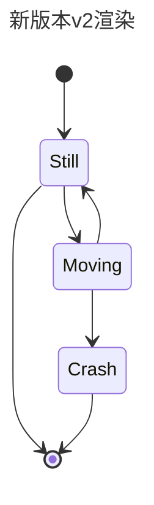
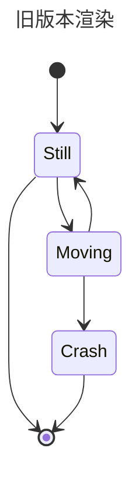
# 状态
有两种描述状态的方式，一种是直接定义，
另一种方式是通过state "名字" as "id"
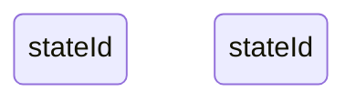
# 过渡
转换是一种状态进入另一种状态时的路径/边缘。这使用文本箭头 "-->" 表示。
当你定义两个状态之间的转换并且状态尚未定义时，未定义的状态将使用转换中的 id 进行定义。可以向以此方式定义的状态添加描述。
如果需要添加内容可以在后面加入:描述即可.
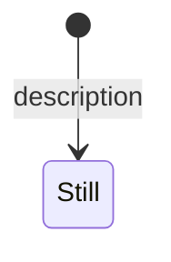
# 开始和结束
有两种特殊状态指示图的开始和停止。它们是用 [*] 语法编写的，并且转换到它的方向将其定义为开始或停止状态。
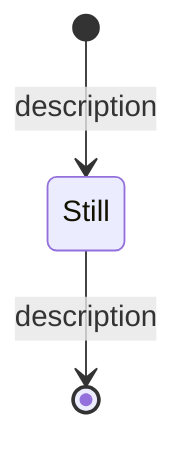

# 复合形式
需要定义复合形态的时候,可以通过如下来实现.
```
state [状态名]{}
```

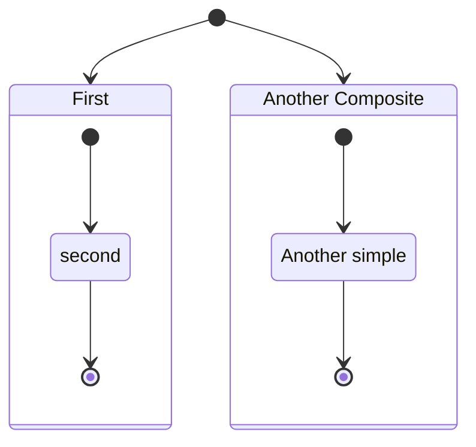
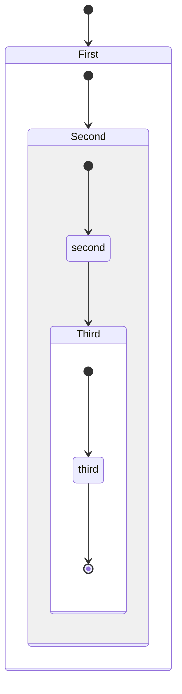
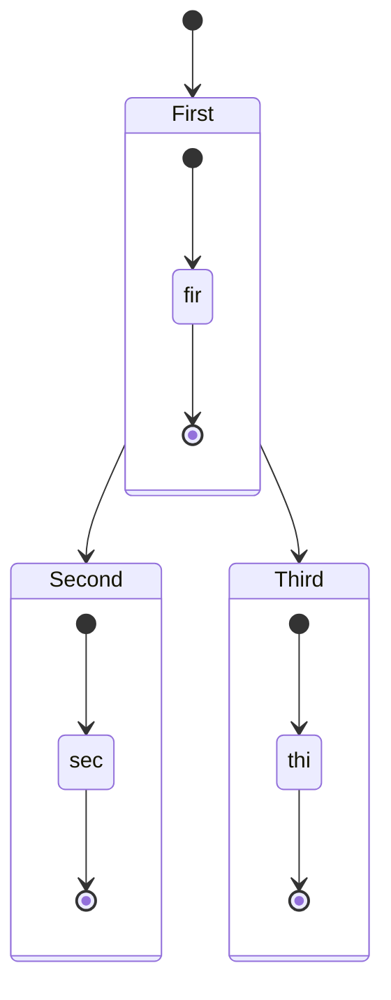
# 判断
当状态需要出现分支的时候，可以使用 <\<choice>> 来实现。
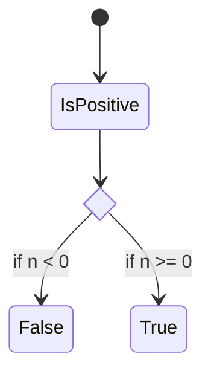
# 合并与分叉
分叉时使用<\<fork>>,合并时使用<\<join>>
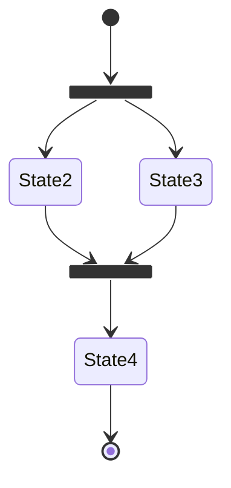
# 笔记
如果是一行笔记的话那么只需要note [位置] of [状态]:[内容]即可.
如果有多行笔记那么就需要 note [位置] of [状态] [多行内容] end note.
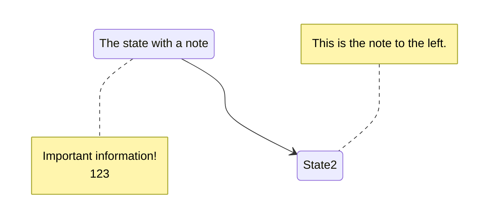
# 并发
当出现状态两者之间是相互循环执行的时候，可以使用--来作为其并发的体现.
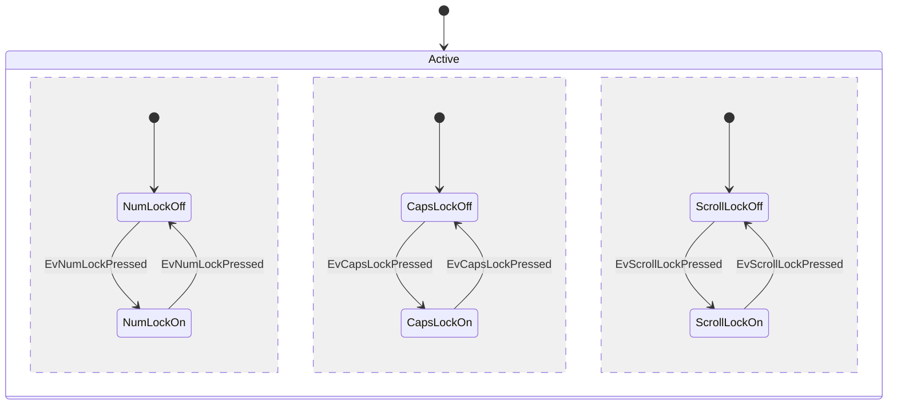
# 方向(参考前面流程图即可)
# 注释(参考前面流程图即可)
# 样式(参考前面流程图)
当前状态图的一些限制：1.不能应用于开始或结束状态
2.不能应用于复合状态或复合状态内
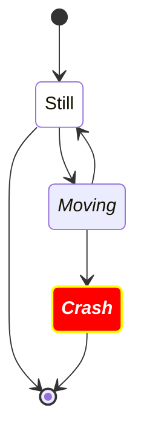
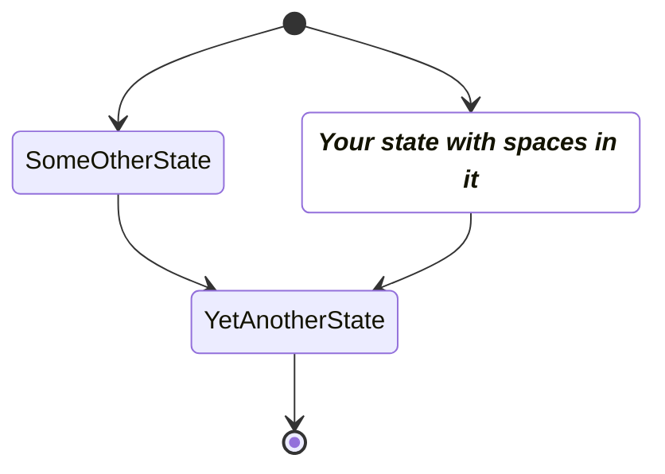