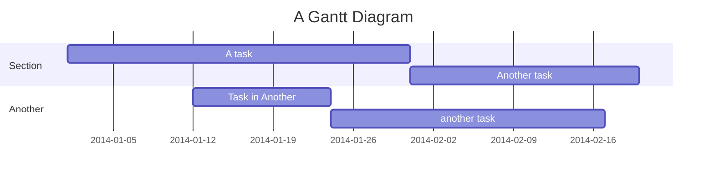
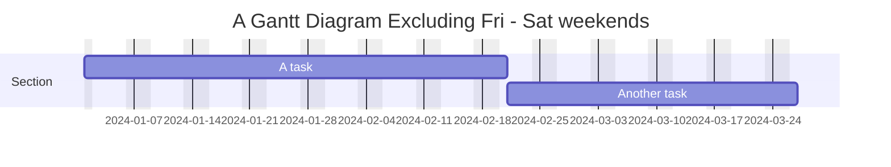
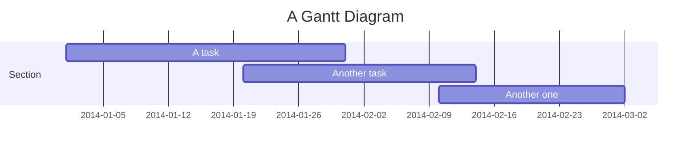

[TOC]
# 甘特图
甘特图是一种柱状图，最初由 Karol Adamiecki 于 1896 年开发，并由 Henry Gantt 在 1910 年代独立开发，它说明了项目进度表以及任何一个项目完成所需的时间。甘特图显示了项目的终端元素和摘要元素的开始日期和完成日期之间的天数。
# 基本使用

# 标题
`title` 是一个可选字符串，显示在甘特图的顶部，用于描述整个图表。
# 不包含
`excludes` 是可选属性，接受 `YYYY-MM-DD` 格式的特定日期、星期几 `sunday` 或 `weekends`.这些日期将标记在图表上，并且不包括在任务的持续时间计算中。

# 周末
排除周末时，可以将周末配置为周五和周六或周六和周日。默认情况下，周末是周六和周日。要定义周末开始日，可以在新行中添加一个可选属性 `weekend`，后跟 `friday` 或 `saturday`。
# 章节
可以将图表划分为各个部分，例如将项目的不同部分（例如开发和文档）分开。
因此，需要以 `section` 关键字开始一行并为其命名。(命名必须与图表标题不同)
# 里程碑
你可以将里程碑添加到图表中。里程碑与任务不同，因为它们代表单个时刻并由关键字 `milestone` 标识。以下是有关如何使用里程碑的示例。你可能会注意到，里程碑的确切位置由里程碑的初始日期和任务的 `duration` 确定

```mermaid
gantt
    dateFormat HH:mm
    axisFormat %H:%M
    Initial milestone : milestone, m1, 17:49, 2m
    Task A : 10m
    Task B : 5m
    Final milestone : milestone, m2, 18:08, 4m
```

# 设置日期
`dateFormat` 定义甘特图元素的日期输入格式。这些日期如何在渲染的图表输出中表示由 `axisFormat` 定义。
# 输入日期格式支持类型
`dateformat YYYY-MM-DD`
其中可供替换的有
输入|	示例|	描述
---|---|---
YYYY|	2014|	4 位数字年份
YY|	14	|2 位数字年份
Q|	1..4|	年的季度。将月份设置为季度的第一个月。
M MM|	1..12|	月份数
MMM MMMM|	一月..十二月|	由 dayjs.locale()| 设置的语言环境中的月份名称
D DD|	1..31|	一个月中的哪一天
Do|	1st..31st|	带序数的月份中的某一天
DDD DDDD|	1..365|	一年中的某一天
X|	1410715640.579|	Unix 时间戳
x|	1410715640579|	Unix 毫秒时间戳
H HH|	0..23|	24 小时时间
h hh|	1..12|	与 a A 一起使用的 12 小时时间。
a A	|上午下午|	午后或午前
m mm|	0..59|	分钟
s ss|	0..59|	秒数
S|	0..9	|十分之一秒
SS|	0..99	|一秒几百
SSS|	0..999|	千分之一秒
Z ZZ|	+12:00|	与 UTC 的偏移量为 +-HH:mm、+-HHmm 或 Z
# 轴字符串类型替换
`axisFormat %Y-%m-%d`
格式|	定义
---|---
%a|	工作日缩写名称
%A|	工作日的完整名称
%b|	月份名称缩写
%B|	月份全名
%c|	日期和时间，如 "%a %b %e %H:%M:%S %Y"
%d|	十进制数形式的月份中的零填充日期 [01,31]
%e|	以空格填充的十进制数字形式的月份日期 [1,31]；相当于%_d
%H|	小时（24 小时制），十进制数 [00,23]
%I|	小时（12 小时制），十进制数 [01,12]
%j|	一年中的第几天，十进制数 [001,366]
%m|	十进制数形式的月份 [01,12]
%M|	分钟为十进制数 [00,59]
%L|	十进制数形式的毫秒 [000, 999]
%p|	上午或下午
%S|	秒为十进制数 [00,61]
%U|	一年中的周数（星期日为一周的第一天），十进制数 [00,53]
%w|	十进制数形式的工作日 [0(Sunday),6]
%W|	一年中的周数（星期一为一周的第一天），十进制数 [00,53]
%x|	日期，如 "%m/%d/%Y"
%X|	时间，如 "%H:%M:%S"
%y|	没有世纪的年份作为十进制数 [00,99]
%Y|	年份，世纪为十进制数
%Z|	时区偏移量，例如 "-0700"
%%|	一个 "%" 字面字符
# 轴刻度(V10.3.0+)
```tickInterval 1day```
此处数字可以替换为1-99之间
day可以替换为:millisecond|second|minute|hour|day|week|month
# 紧凑模式
紧凑模式允许你在同一行中显示多个任务。通过前面的 YAML 设置设置图形的显示模式，可以为甘特图启用紧凑模式。

# 样式
甘特图的样式是通过定义许多 CSS 类来完成的。在渲染期间，这些类是从位于 src/diagrams/gantt/styles.js 的文件中提取的
类|	描述
---|---
grid.tick|	网格线的样式
grid.path|	网格边框的样式
.taskText|	任务文本样式
.taskTextOutsideRight|	超出右侧活动栏的任务文本的样式。
.taskTextOutsideLeft|	超出活动栏、向左的任务文本的样式。
todayMarker|"今日标记" 的切换和样式
# 今日标记
```
设置标记样式
todayMarker stroke-width:5px,stroke:#0f0,opacity:0.5
隐藏标记
todayMarker off
```
# 配置
```
mermaid.ganttConfig = {
  titleTopMargin: 25, // Margin top for the text over the diagram
  barHeight: 20, // The height of the bars in the graph
  barGap: 4, // The margin between the different activities in the gantt diagram
  topPadding: 75, // Margin between title and gantt diagram and between axis and gantt diagram.
  rightPadding: 75, // The space allocated for the section name to the right of the activities
  leftPadding: 75, // The space allocated for the section name to the left of the activities
  gridLineStartPadding: 10, // Vertical starting position of the grid lines
  fontSize: 12, // Font size
  sectionFontSize: 24, // Font size for sections
  numberSectionStyles: 1, // The number of alternating section styles
  axisFormat: '%d/%m', // Date/time format of the axis
  tickInterval: '1 week', // Axis ticks
  topAxis: true, // When this flag is set, date labels will be added to the top of the chart
  displayMode: 'compact', // Turns compact mode on
  weekday: 'sunday', // On which day a week-based interval should start
};
```
# 事件调用（参考流程图)