[TOC]
# 类图
类图是面向对象建模的主要构建块。它用于应用结构的一般概念建模，以及将模型转换为编程代码的详细建模。类图也可用于数据建模。类图中的类表示主要元素、应用中的交互以及要编程的类。
# 基本使用
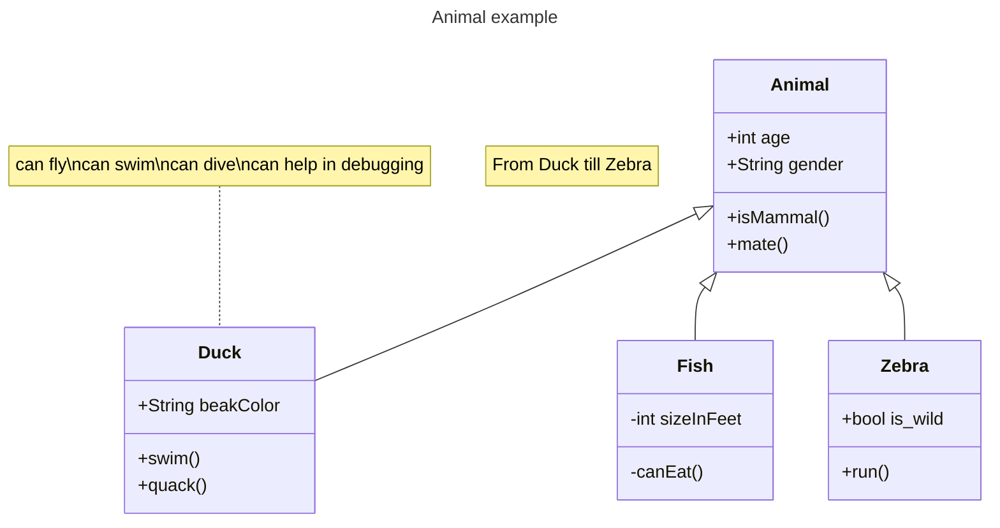
## 类属性
* 顶部隔间包含类的名称。它以粗体居中打印，第一个字母大写。它还可能包含描述类性质的可选注释文本。
* 中间的部分包含类的属性。它们左对齐且第一个字母小写。
* 底部隔间包含该类可以执行的操作。它们也是左对齐的，并且第一个字母是小写的。
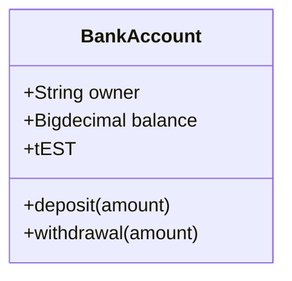
## 类定义
* 第一种方式是直接定义的方式
* 第二种方式是通过间接生成关系从而定义出某个类
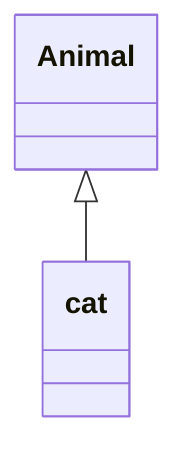
## 类属性方法定义
* 第一种方式是通过逐个声明
* 第二种方式是以对象形式存入
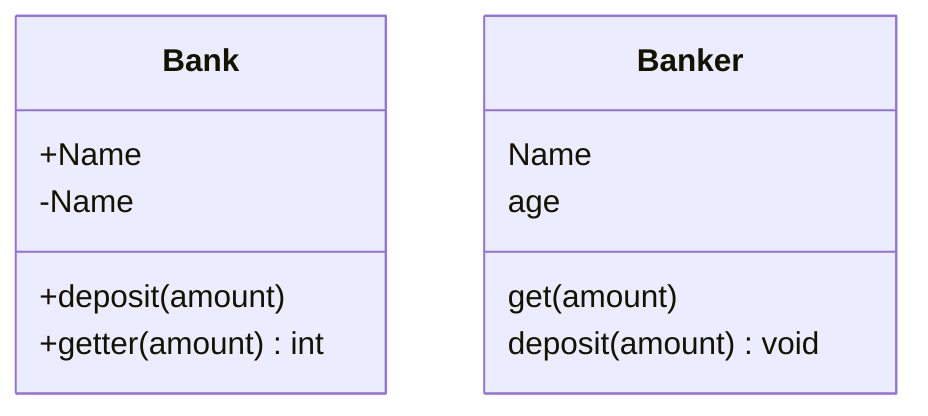
## 方法类型
* 直接返回int,void等基础类型
如果通过该方法那么在相关方法后面空格+类型即可.
* 返回泛型
泛型可以表示为类定义的一部分，也可以表示为类成员/返回类型。为了将该项目表示为通用项，需要将该类型括在~内。支持嵌套类型声明，不过不支持包含逗号的泛型，例如List<k,v>
* 描述类的访问属性
为了描述属于类（即类成员）的属性或方法/函数的可见性（或封装），可以在该成员名称之前放置可选的符号：
    * public 公开 +
    * private 私有 -
    * protected 受保护 #
    * package/internal 封装/内部 ~
    其他类型通过在末尾添加符号来实现
    * abstract 抽象 *
    * static 静态 $
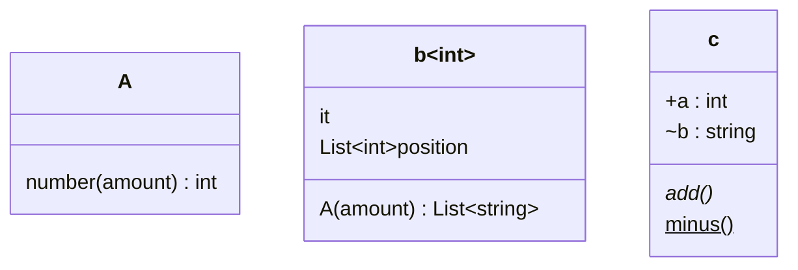
## 类关系               
[A] [关系] [B]
其中关系类型有以下八种
类型|描述
---|---
`<\|--`|继承
`*--`|作品
`o--`|聚合
`-->`|关联
`--`|链接(实线)
`..>`|依赖
`..\|>`|实现
`..`|链接(虚线)
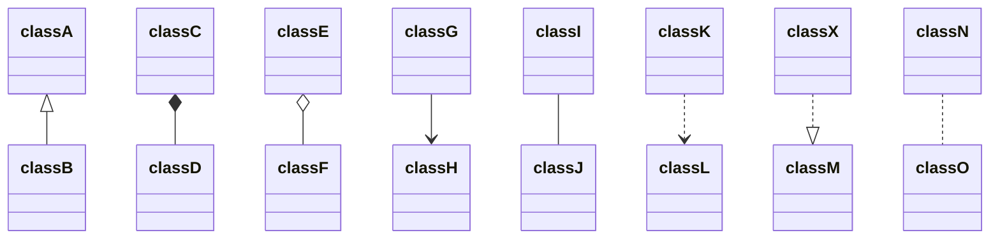
如果需要双向关系的话，那么可以通过将上述单向补充为对称关系即可.
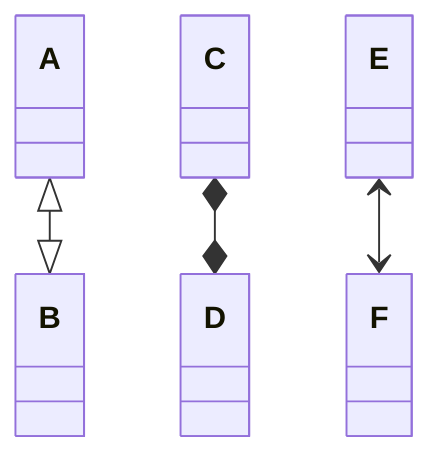
## 命名空间
将内容类似于盒子的形式存放到一块空间中
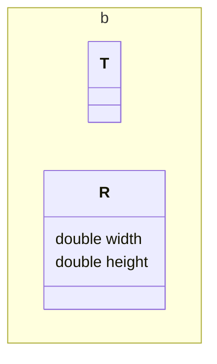
## 类关系多重性与基数
如果需要表示一对多或者一对一之类的关系可以通过以下格式实现
[classA] "[number]" [Arrow] ["number"] ["classB"]
可提供的number选项有
* 0..1 0或者1
* 1..* n(n>=1)
*  \*  许多
* n    n(n>1)
* 0..n 0到n(n>1)
* 1..n 1到n(n>1)
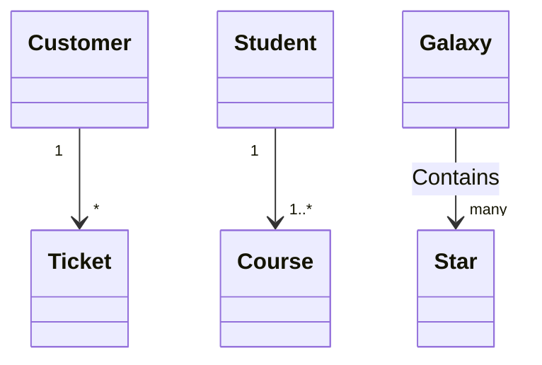
## 类注释
可以使用标记来注释类，以提供有关该类的附加元数据。这可以更清楚地表明其性质。一些常见的注释包括：
* <\<Interface>> 表示一个接口类
* <\<Abstract>> 表示一个抽象类
* <\<Service>> 代表一个服务类
* <\<Enumeration>> 表示一个枚举
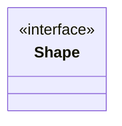
## 笔记
可以通过`note line1\nline2`来实现，或者`note for className line1\nline2`
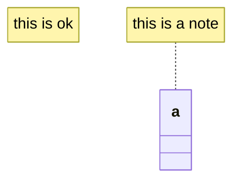
## 图表方向
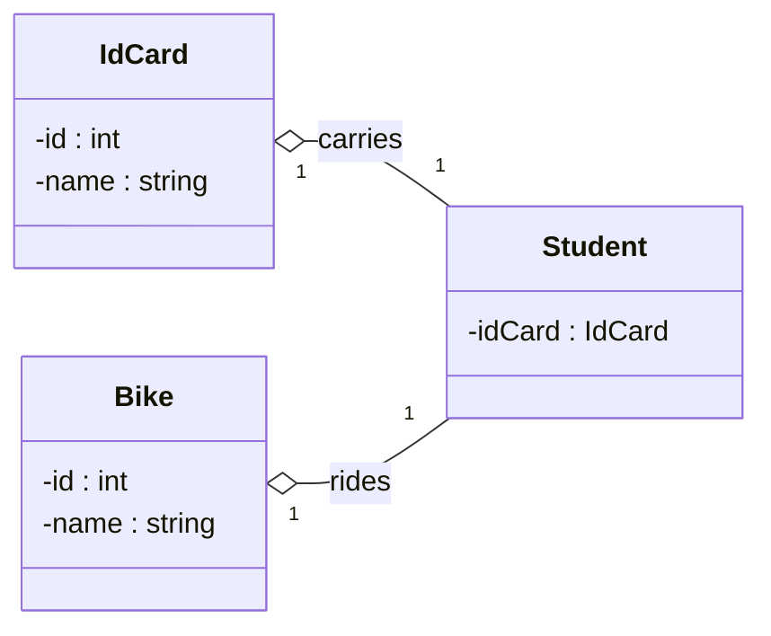
## 绑定事件(可以参考序列图)
## 样式绑定(可以参考流程图)
与流程图类似的使用方式，通过设置style来实现，目前无法在图中定义css类，也不能同关系语句同时添加
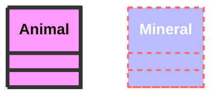
类图的主要样式是通过预设数量的 css 类完成的。在渲染期间，这些类从位于 src/themes/class.scss 的文件中提取。这里使用的类描述如下：
类|描述
--|--
[class].title|标题
g.classGroup text|文本
g.classGroup rect|矩形样式
g.classGroup line|图线样式
.classLabel .box|标签框样式
.classLabel .label|标签文本样式
composition|组合箭头和箭头线样式
agrreagation|聚合箭头和箭头线样式
dependency|依赖箭头和箭头线样式

## 类别颜色
变量|	默认值|	描述
---|---|---
classText|textColor|类图中文本的颜色
