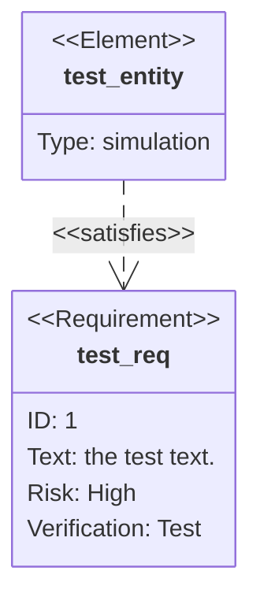
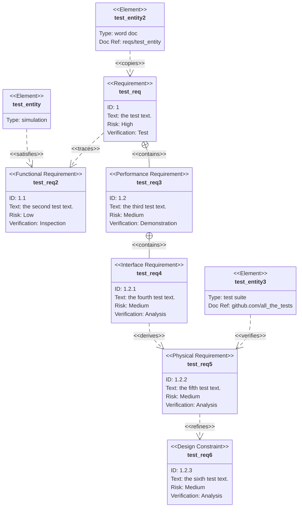

# 需求图
需求图提供了需求及其相互之间以及其他记录元素之间的联系的可视化。建模规范遵循 SysML v1.6 定义的规范。
# 基本使用


# 语法
需求图包含三种类型的组件：要求、要素和关系。
用于定义每个的语法定义如下。尖括号中表示的单词（例如 \<word>）是枚举关键字，其选项在表格中详细说明。user_defined_... 用于任何需要用户输入的地方。
关于用户文本的重要说明：所有输入都可以用引号引起来，也可以不用引号引起来。例如，Id: "here is an example" 和 Id: here is an example 都有效,但是不加引号有可能会与部分关键字冲突.

## 要求
需求定义包含需求类型、名称、ID、文本、风险和验证方法。
```
<type> user_defined_name {
    id: user_defined_id
    text: user_defined text
    risk: <risk>
    verifymethod: <method>
}
```
类型、风险和方法是 SysML 中定义的枚举。
关键词|	选项
---|---
类型	|需求、功能需求、接口需求、性能需求、物理需求、设计约束
风险	|低中高
验证方法|	分析、检验、测试、演示

## 元素
元素定义包含元素名称、类型和文档引用。元素功能旨在轻量级，但允许将需求连接到其他文档的部分。
element user_defined_name {
    type: user_defined_type
    docref: user_defined_ref
}
## 关系
关系由源节点、目标节点和关系类型组成。
每个都遵循以下定义格式
```
{name of source} - <type> -> {name of destination}
or
{name of destination} <- <type> - {name of source}
```
关系类型可以是包含、复制、派生、满足、验证、细化或跟踪之一。
