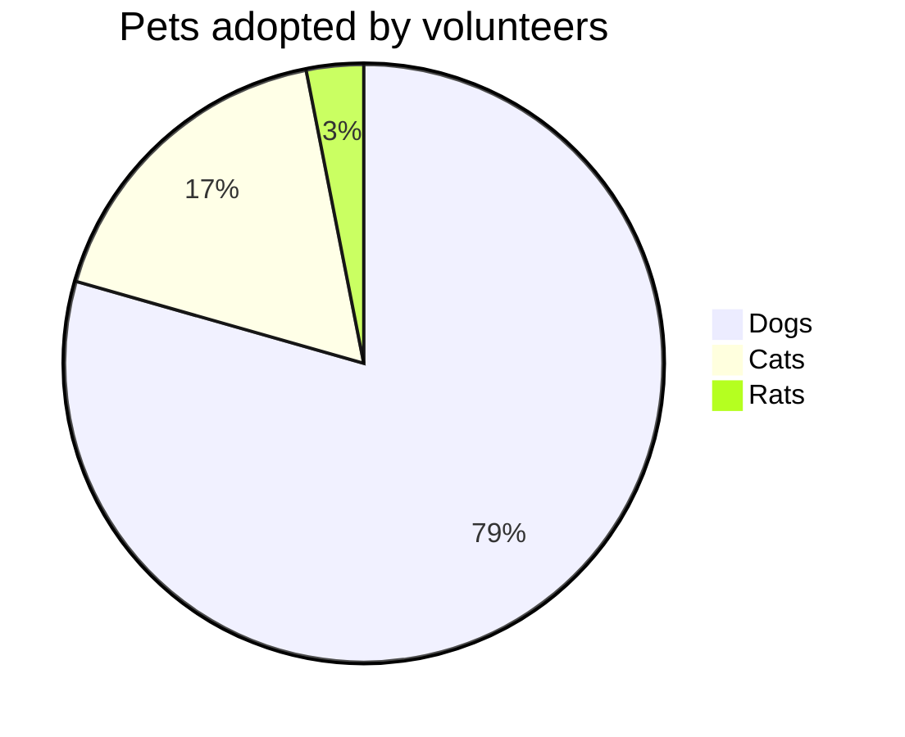

# 饼图
饼图（或圆形图）是一种圆形统计图形，将其划分为多个切片以说明数字比例。在饼图中，每个切片的弧长（及其中心角和面积）与其表示的数量成正比。虽然它因其类似于切片的馅饼而得名，但它的渲染方式却有多种变化。
# 基本使用

```mermaid
pie 
title Pets adopted by volunteers
    "Dogs" : 386
    "Cats" : 85
    "Rats" : 15
```
# 语法
pie -- 声明图
title --声明标题
"label" : "value" --声明表名与对应的值，其中value最多支持两位小数