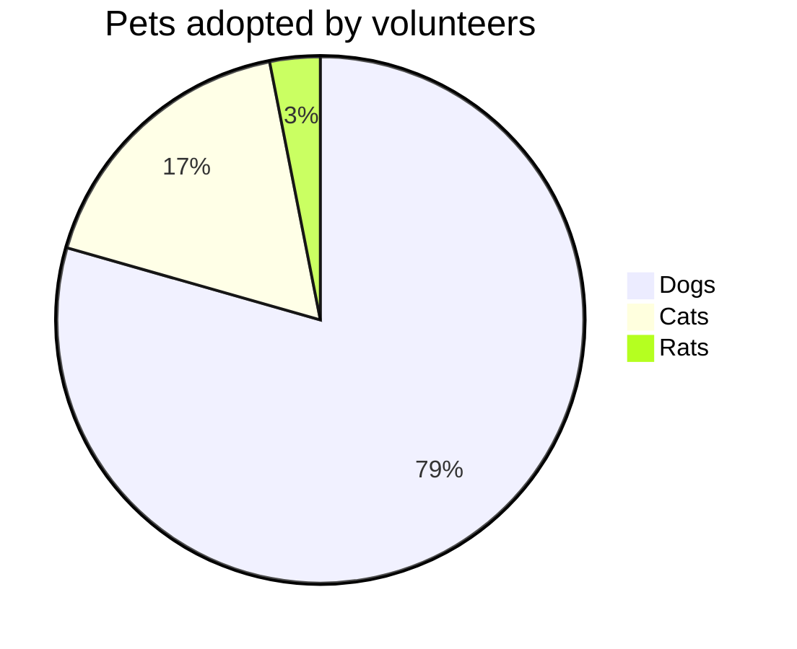

# 饼图
饼图（或圆形图）是一种圆形统计图形，将其划分为多个切片以说明数字比例。在饼图中，每个切片的弧长（及其中心角和面积）与其表示的数量成正比。虽然它因其类似于切片的馅饼而得名，但它的渲染方式却有多种变化。
# 基本使用

# 语法
pie -- 声明图
title --声明标题
"label" : "value" --声明表名与对应的值，其中value最多支持两位小数

# 饼图变量
变量|	默认值	|描述
---|---|---
pie1|	primaryColor|	填写饼图中的第一部分
pie2|	secondaryColor|	填写饼图的第二部分
pie3|	从三级计算	|填写饼图中的第三部分
pie4|	从原色计算|	填写饼图中的第四部分
pie5|	从 secondaryColor 计算|	填写饼图中的第五部分
pie6|	从 tertiaryColor 计算	|填写饼图中的第 六 部分
pie7|	从原色计算|	填写饼图第七部分
pie8|	从原色计算|	填写饼图第 八 部分
pie9|	从原色计算|	填写饼图中的第 九 部分
pie10|	从原色计算|	填写饼图中的第 十 部分
pie11	|从原色计算|	填写饼图第 十一 部分
pie12	|从原色计算|	填写饼图第 十二 部分
pieTitleTextSize|	25px	|标题文本大小
pieTitleTextColor|	taskTextDarkColor|	标题文本颜色
pieSectionTextSize|	17px|	各个部分标签的文本大小
pieSectionTextColor|	textColor|	各个部分标签的文本颜色
pieLegendTextSize	|17px|	图表图例中标签的文本大小
pieLegendTextColor|	taskTextDarkColor|	图表图例中标签的文本颜色
pieStrokeColor|	black|	各个饼图部分的边框颜色
pieStrokeWidth|	2px|	各个饼图部分的边框宽度
pieOuterStrokeWidth|	2px|	饼图外圆的边框宽度
pieOuterStrokeColor|	black|	饼图外圆的边框颜色
pieOpacity|	0.7|	各个饼图部分的不透明度